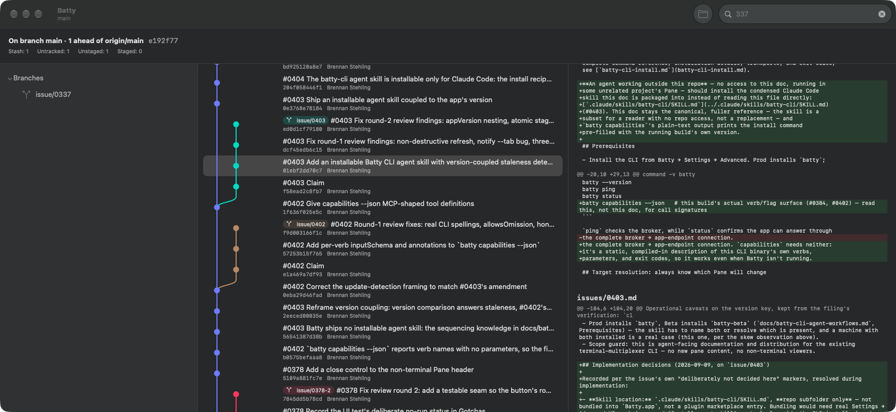
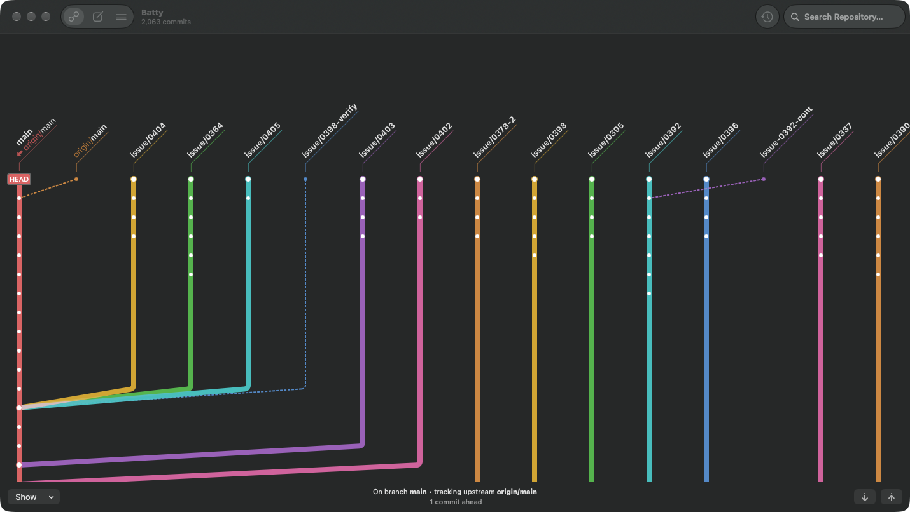

# 0399 — The graph view shows commit text; it should be a branch map like GitUp's

| | |
|---|---|
| **Status** | in-progress |
| **Module** | YardUI |
| **Milestone** | M9 |
| **Platform** | macOS |
| **First seen** | 2026-09-22 |

## Description

The center pane puts a commit subject, short SHA and author next to every node, which turns the
graph into a text log. Brennan compared it with GitUp open on the same repository (Batty, about
2,069 commits and 127 branches) and asked for the graph to work like GitUp's map. His words:

> *"I do not see any value in having all of that text next to the colored branches. The goal was
> to be more like the GitUp app… We do not need the commit text in the graph view. What we want is
> all available local branches to be easy to browse."*

Both screenshots were taken 2026-09-22 with each app open on `~/Developer/brennanMKE/Batty`:





What GitUp's map does, as seen in the screenshot and described in our own words:

- **There is no commit text in the graph.** Commits are dots on coloured lines.
- **Every local branch is labelled at its tip** with a slanted name label above its lane, so a
  glance across the top shows every branch.
- The lanes are laid out horizontally side by side, so many branches are visible at once and
  browsing means scanning across as well as down.
- Remote-tracking refs (`origin/main`) and `HEAD` are marked at their commits.

**Clean-room:** GitUp is GPLv3 (CLAUDE.md, Licensing). This issue works only from the screenshot
and the behaviour described above. Nobody reads GitUp's graph-layout source to implement it.

## Expected behavior

This is the umbrella for the redesign. It is split into implementable children during planning:

- [ ] **#0399 itself:** graph rows carry no commit subject, SHA or author text. The node and lane
      drawing are the whole row, and the row gets as compact as the nodes allow. Commit identity
      moves to the detail pane (#0403), which already shows it for the selected node.
- [ ] Every local branch is labelled at its tip in the graph, so all local branches can be browsed
      from the graph (#0400).

## Plan for #0399 itself (planning update, 2026-09-22)

**Decision (Rule 12, high confidence):** the ref chips stay. They are the branch labels drawn at
each commit that a branch, remote or tag points at, which is exactly the "label at the tip"
Brennan asked for. #0399 removes the subject, short SHA and author, and compacts the rows. What
#0400 still needs after this lands is re-assessed then.

### Files and literal changes

**`YardKit/Sources/YardUI/CommitHistoryView.swift`**

1. In `private struct CommitHistoryRow`, replace the whole `var body: some View { ... }` with:

```swift
    var body: some View {
        let isRemoteOnly = localOids.map { !$0.contains(entry.oid) } ?? false
        HStack(alignment: .center, spacing: 4) {
            LaneGutterView(row: graphRow, segments: segments, owners: owners, localOids: localOids,
                           isHead: isHead, width: gutterWidth)
            // #0399: no subject, SHA or author in the graph; the chips are
            // the only text, naming each branch, remote and tag at its commit.
            // The Detail pane carries the commit's identity.
            ForEach(chips, id: \.self) { chip in
                RefChipView(chip: chip, tint: BranchColor.color(for: chip))
            }
            .opacity(isRemoteOnly ? 0.6 : 1)
            Spacer(minLength: 0)
        }
        .frame(height: CommitHistoryRow.rowHeight)
        .accessibilityElement(children: .combine)
        .accessibilityLabel(CommitRowAccessibility.label(entry: entry, chips: chips))
    }

    /// #0399: a graph row is as tall as a node and a chip need, not a
    /// two-line text row.
    static let rowHeight: CGFloat = 22
```

2. Replace the struct's doc comment (the `/// One row: a lane gutter, then ref chips and the subject,
   short OID, author.` paragraph) with:

```swift
/// One row: a lane gutter, then the ref chips for the commit (#0358, #0367)
/// -- branches and remotes from the sidebar's snapshot, tags and a detached
/// `HEAD` from `%D`. #0399: no commit text; the whole row is still one
/// VoiceOver element speaking `CommitRowAccessibility.label`, which keeps
/// the subject, short OID and author. A commit no local tip reaches (#0368)
/// draws its chips at 0.6 opacity.
```

3. In `CommitHistoryView.body`, add `.environment(\.defaultMinListRowHeight, CommitHistoryRow.rowHeight)`
   directly after `.listRowSeparator(.hidden)`'s closing `}` of the `List`, i.e. as the first
   modifier on the `List`, before `.copyable`. (If #0401 has already wrapped the `List` in a
   `ScrollViewReader`, it goes on the `List` inside the reader.)

**`SwitchyardUITests/UITestSupport.swift`**: `historyRows(containing:)` must find the row by its
accessibility label whatever element type the combined row reports once it holds no `Text`.
Change `return staticTexts.matching(NSPredicate(` to
`return descendants(matching: .any).matching(NSPredicate(`. The predicate itself is unchanged.

**`SwitchyardUITests/0399CompactGraphRowsUITests.swift`** (new):

```swift
import XCTest

/// #0399: graph rows carry no commit text, so they are compact -- one
/// node and its chips, not a two-line subject/SHA/author row.
final class Spike0399CompactGraphRowsUITests: XCTestCase {
    @MainActor
    func testGraphRowsAreCompact() {
        let app = XCUIApplication()
        app.launchWithFixtureRepository()

        let row = app.historyRows(containing: UITestFixture.thirdSubject).firstMatch
        XCTAssertTrue(row.waitForExistence(timeout: 30), "no History row for the third commit")
        XCTAssertLessThanOrEqual(
            row.frame.height, 26,
            "a History row is \(row.frame.height) pt tall -- it still lays out commit text")
    }
}
```

**`scripts/run-ui-tests-vm.sh`**: add `run_spike_if_selected 0399 Spike0399CompactGraphRowsUITests`
after the last existing `run_spike_if_selected` line.

### Verification

1. `cd YardKit && swift test`: all `Test run with N tests` lines pass, with the counts unchanged
   from the baseline (no package tests are added or removed).
2. From the worktree root:
   `xcodebuild build-for-testing -project Switchyard.xcodeproj -scheme 'Switchyard UITests' -destination 'platform=macOS' CODE_SIGNING_ALLOWED=NO CODE_SIGNING_REQUIRED=NO -derivedDataPath build/dd -quiet`
   ends without `error:`. Do not run UI tests on this Mac (AGENTS.md Rule 13).
3. The reviewer runs the whole VM suite (`./scripts/run-ui-tests-vm.sh`). Every existing spike
   test must still pass with the changed `historyRows(containing:)`, and 0399 must pass.

Mutation for the reviewer: restore the `Text(entry.subject)` line in the row. The 0399 VM test
must fail.

## Notes

- Selecting a node still selects the commit and drives the detail pane. Only the text goes.
- The lane colours already exist (`LaneGutterView`); the change removes text, it does not redraw
  lanes.

## Work log

- **2026-09-22, round 1 (Sonnet):** 98,578 subagent tokens, 578 s wall. Applied the plan with no
  deviations. Package counts were unchanged; run 1 hit the #0408 reaper flake and run 2 was clean.
  The UI-test target built unsigned. **Rule 3c slip:** the round started its baseline `swift test`
  in the background, and its edits landed mid-run. The counts aren't affected because no test
  files changed, but that run isn't a true pre-edit baseline. Committed `a4ebc32` on `issue/0399`.
