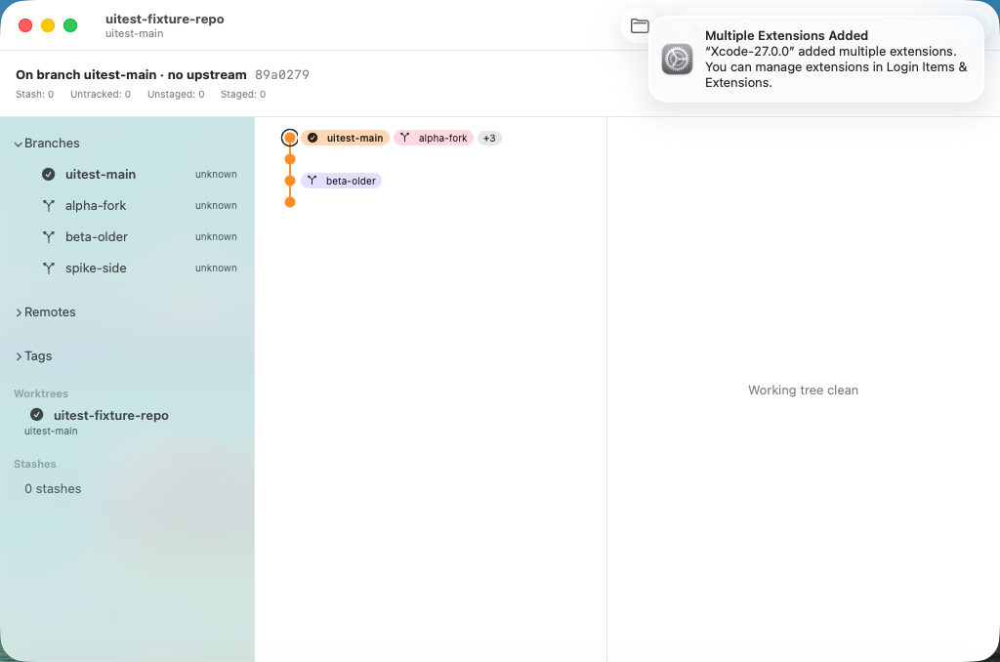

# 0402 — The filter narrows only the sidebar; searching `337` or `#0337` leaves the graph unchanged

| | |
|---|---|
| **Status** | resolved |
| **Module** | YardUI |
| **Milestone** | M9 |
| **Platform** | macOS |
| **First seen** | 2026-09-22 |
| **Branch** | `issue/0402` |
| **Commit** | `fc6c685` |

## Description

Brennan searched for `337` and for `#0337`: *"it did not change the middle content. It did show
the branch on the left panel."* The toolbar filter narrows the sidebar's ref lists (#0378) but has
no effect on the graph, which is where the user is looking.

## Steps to reproduce

1. Open Batty, where many commit subjects start with `#0337`.
2. Type `337` or `#0337` into the toolbar filter.

## Expected behavior

- [ ] Commits whose subject, message or SHA prefix match the filter text are highlighted in the
      graph, and non-matching nodes are dimmed. With the text gone from the graph (#0399),
      highlighting is how a match shows.
- [ ] The graph scrolls to the first match, and a keyboard shortcut or buttons step to the
      next and previous match.
- [ ] Clearing the filter restores the normal graph with the selection unchanged.
- [ ] The sidebar keeps narrowing as it does today (#0378).

## Actual behavior

The center pane doesn't change at all.

## Notes

Highlight-and-dim rather than removing non-matches: removing rows breaks the lanes, because a
filtered graph no longer shows which commits connect. The planning pass should confirm that
choice against `LaneGeometry`.

## Plan (planning update, 2026-09-22)

**Depends on #0401 (merged: `ScrollViewReader` in `CommitHistoryView`) and #0399 (the row body).**
Dispatch after both have merged. Anchors are named by content.

**Decisions (Rule 12):**
- Non-matching rows dim to 0.25 opacity instead of disappearing, so the lanes stay intact.
- One filter field, the sidebar's existing one, drives both the sidebar and the graph. Its text
  moves up to `ContentView`.
- A match bar at the top of the History pane reads "N matches", with previous and next buttons
  (⇧⌘G / ⌘G). Each button selects the match and scrolls it to the centre.

### Files and literal changes

#### 1. `YardKit/Sources/YardUI/HistoryFilter.swift` (new)

```swift
// HistoryFilter.swift
//
// #0402: which History rows the filter field matches. A commit matches when
// its message (subject or body) contains the query, case- and
// diacritic-insensitively; when a ref chip on it matches the way the sidebar
// matches ref names (`RefFilter`); or when the query is a hex prefix (4+
// characters) of its oid.

import Foundation
import YardGit

public nonisolated enum HistoryFilter {
    /// The trimmed query; empty means the filter is off.
    public static func normalized(_ query: String) -> String {
        query.trimmingCharacters(in: .whitespaces)
    }

    public static func matches(_ entry: CommitLogEntry, chips: [RefChip], query: String) -> Bool {
        let q = normalized(query)
        if q.isEmpty { return true }
        if entry.message.range(of: q, options: [.caseInsensitive, .diacriticInsensitive]) != nil {
            return true
        }
        if chips.contains(where: { RefFilter.matches($0.name, query: q) }) { return true }
        let lower = q.lowercased()
        if lower.count >= 4, lower.allSatisfy(\.isHexDigit), entry.oid.hasPrefix(lower) {
            return true
        }
        return false
    }
}
```

#### 2. `YardKit/Sources/YardUI/RepositorySidebarView.swift`

- Replace `@State private var refFilter = ""` (and keep its doc comment, adding `#0402: owned by
  ContentView so the History pane filters too.`) with `@Binding private var refFilter: String`.
- Add the init parameter `refFilter: Binding<String> = .constant("")` after `selectedResolution:`
  and before `selectedRef:`, and assign `self._refFilter = refFilter`. The `.searchable(text: $refFilter, …)`
  line and every other `refFilter` use stay unchanged.

#### 3. `YardKit/Sources/YardUI/CommitHistoryView.swift`

a. A stored property after `scrollRequest`, and an init parameter `highlightQuery: String = "",`
   directly before `selection:`:

```swift
    /// #0402: the filter field's text; non-matching rows dim.
    private let highlightQuery: String
    /// #0402: which match the previous/next buttons are on.
    @State private var matchIndex = 0
```

b. In `body`, after the `let gutterWidth = …` line, add:

```swift
        let query = HistoryFilter.normalized(highlightQuery)
        let chipsByOid: [String: [RefChip]] = Dictionary(
            entries.map { entry in
                (entry.oid, refs.map { RefChips.make(oid: entry.oid, refs: $0, decoration: entry.refs) } ?? [])
            },
            uniquingKeysWith: { first, _ in first })
        let matchOids: [String] = query.isEmpty ? [] : entries.compactMap { entry in
            HistoryFilter.matches(entry, chips: chipsByOid[entry.oid] ?? [], query: query) ? entry.oid : nil
        }
        let matchSet = Set(matchOids)
```

c. In the row, replace
   `chips: refs.map { RefChips.make(oid: entry.oid, refs: $0, decoration: entry.refs) } ?? [],`
   with `chips: chipsByOid[entry.oid] ?? [],`. Add `.opacity(query.isEmpty || matchSet.contains(entry.oid) ? 1 : 0.25)`
   after the row's `.listRowSeparator(.hidden)`.

d. Wrap the `List` in a `VStack(spacing: 0)` inside the `ScrollViewReader`, with the match bar
   above it. The existing modifiers stay on the `List`:

```swift
        ScrollViewReader { proxy in
            VStack(spacing: 0) {
                if !query.isEmpty {
                    matchBar(matchOids: matchOids, proxy: proxy)
                    Divider()
                }
                List( /* unchanged */ ) { … }
                    // … every existing modifier, unchanged, including #0401's onChange …
            }
            // #0402: typing jumps to the first match.
            .onChange(of: query) { _, _ in
                matchIndex = 0
                if let first = matchOids.first {
                    withAnimation { proxy.scrollTo(first, anchor: .center) }
                }
            }
        }
```

e. Add this method to `CommitHistoryView`:

```swift
    /// #0402: "N matches" with previous/next. Stepping selects the match (so
    /// the Detail pane follows) and scrolls it to the centre.
    private func matchBar(matchOids: [String], proxy: ScrollViewProxy) -> some View {
        HStack(spacing: 8) {
            Text(matchOids.count == 1 ? "1 match" : "\(matchOids.count) matches")
                .font(.caption)
                .foregroundStyle(.secondary)
            Spacer()
            Button {
                step(-1, in: matchOids, proxy: proxy)
            } label: {
                Image(systemName: "chevron.up")
            }
            .keyboardShortcut("g", modifiers: [.command, .shift])
            .help("Previous match (⇧⌘G)")
            .disabled(matchOids.isEmpty)
            Button {
                step(1, in: matchOids, proxy: proxy)
            } label: {
                Image(systemName: "chevron.down")
            }
            .keyboardShortcut("g", modifiers: .command)
            .help("Next match (⌘G)")
            .disabled(matchOids.isEmpty)
        }
        .buttonStyle(.borderless)
        .padding(.horizontal, 8)
        .padding(.vertical, 4)
    }

    private func step(_ delta: Int, in matchOids: [String], proxy: ScrollViewProxy) {
        guard !matchOids.isEmpty else { return }
        matchIndex = (matchIndex + delta + matchOids.count) % matchOids.count
        let oid = matchOids[matchIndex]
        selection = oid
        withAnimation { proxy.scrollTo(oid, anchor: .center) }
    }
```

#### 4. `YardKit/Sources/YardUI/ContentView.swift`

- Add `@State private var filterText = ""` next to `selectedRef`, with the doc comment
  `/// #0402: the one filter field's text -- the sidebar narrows refs, the History pane dims non-matches.`
- In `sidebarPane(summary:)`, pass `refFilter: $filterText,` after the `selectedResolution:`
  argument.
- In `historyPane(summary:)`, pass `highlightQuery: filterText,` directly before `selection:`.

#### 5. Tests

**`YardKit/Tests/YardUITests/HistoryFilterTests.swift`** (new):

```swift
// HistoryFilterTests.swift
//
// #0402: the History filter's match rule. Public API, no @testable.

import Testing
import YardGit
import YardUI

private func entry(_ message: String, oid: String = "abcdef0123456789abcdef0123456789abcdef01") -> CommitLogEntry {
    CommitLogEntry(oid: oid, parents: [], author: "A", refs: "",
                   signatureStatus: .noSig, message: message, trailers: [])
}

@Test("an empty or blank query matches every commit")
func blankQueryMatchesEverything() {
    #expect(HistoryFilter.matches(entry("anything"), chips: [], query: ""))
    #expect(HistoryFilter.matches(entry("anything"), chips: [], query: "   "))
}

@Test("a query matches the subject case-insensitively, including a leading #")
func queryMatchesSubject() {
    let e = entry("#0337 Add per-Session pane focus history\n\nbody")
    #expect(HistoryFilter.matches(e, chips: [], query: "#0337"))
    #expect(HistoryFilter.matches(e, chips: [], query: "337"))
    #expect(HistoryFilter.matches(e, chips: [], query: "PANE FOCUS"))
}

@Test("a query matches the body, not only the subject")
func queryMatchesBody() {
    #expect(HistoryFilter.matches(entry("subject\n\nthe clipboard policy"), chips: [], query: "clipboard"))
}

@Test("a query matches a ref chip's name")
func queryMatchesChip() {
    let chip = RefChip(name: "feature/0337", kind: .localBranch, isHead: false)
    #expect(HistoryFilter.matches(entry("unrelated"), chips: [chip], query: "0337"))
}

@Test("a hex query of four or more characters matches an oid prefix")
func hexQueryMatchesOidPrefix() {
    #expect(HistoryFilter.matches(entry("x"), chips: [], query: "abcd"))
    #expect(!HistoryFilter.matches(entry("x"), chips: [], query: "abc"))
    #expect(!HistoryFilter.matches(entry("x"), chips: [], query: "bcde"))
}

@Test("a query that matches nothing does not match")
func nonMatchingQueryDoesNotMatch() {
    #expect(!HistoryFilter.matches(entry("Fix the build"), chips: [], query: "clipboard"))
}
```

`YardKit/Tests/YardUITests/RerereSurfaceTests.swift` constructs `RepositorySidebarView(` at line 287.
It keeps compiling because `refFilter` has a default. Don't change it.

**`SwitchyardUITests/0402FilterHighlightsGraphUITests.swift`** (new):

```swift
import XCTest

/// #0402: typing in the filter acts on the graph -- the match bar counts
/// matches and ⌘G selects the match.
final class Spike0402FilterHighlightsGraphUITests: XCTestCase {
    @MainActor
    func testFilterCountsMatchesAndNextSelectsTheMatch() {
        let app = XCUIApplication()
        app.launchWithFixtureRepository()
        let filter = app.sidebarFilterField()
        XCTAssertTrue(filter.waitForExistence(timeout: 30), "no filter field")
        filter.click()
        filter.typeText("third commit")

        let count = app.staticTexts.matching(NSPredicate(
            format: "label == '1 match' OR value == '1 match'")).firstMatch
        XCTAssertTrue(count.waitForExistence(timeout: 10), "the match bar does not say 1 match")

        app.typeKey("g", modifierFlags: .command)
        let headline = app.staticTexts.matching(NSPredicate(
            format: "value == %@ OR label == %@",
            UITestFixture.thirdSubject, UITestFixture.thirdSubject)).firstMatch
        XCTAssertTrue(headline.waitForExistence(timeout: 10),
                      "⌘G did not select the matching commit")
    }
}
```

`scripts/run-ui-tests-vm.sh`: add `run_spike_if_selected 0402 Spike0402FilterHighlightsGraphUITests`
after the last `run_spike_if_selected` line.

### Verification

1. `cd YardKit && swift test`: baseline first. Afterwards every bundle passes and YardUITests is
   up by exactly 6.
2. From the worktree root:
   `xcodebuild build-for-testing -project Switchyard.xcodeproj -scheme 'Switchyard UITests' -destination 'platform=macOS' CODE_SIGNING_ALLOWED=NO CODE_SIGNING_REQUIRED=NO -derivedDataPath build/dd -quiet`
   has no `error:`. No UI tests on this Mac (Rule 13). The reviewer runs the VM suite.

Mutations for the reviewer:
- Remove the `entry.message.range(of:)` check. `queryMatchesSubject` must fail.
- Change `lower.count >= 4` to `>= 3`. `hexQueryMatchesOidPrefix` must fail.
- Pass `highlightQuery: ""` from `ContentView`. The 0402 VM test must fail.

## Work log

- **2026-09-22, round 1 (Sonnet):** 141,531 subagent tokens, 858 s wall. YardUITests 268 → 274,
  all green, UI-test target built. One deviation: the pasted `nonMatchingQueryDoesNotMatch`
  collided with a free function of the same name in `RefFilterTests.swift`, so the round renamed
  it `nonMatchingHistoryQueryDoesNotMatch`. That's a planning slip: preflight's collision check
  compares `@Test` display names, not function names. Committed `fc6c685` on `issue/0402`.

## Resolved — 2026-09-23

Review:
- **Mutations:** removing the message match fails `queryMatchesSubject` and `queryMatchesBody`.
  `>= 3` fails `hexQueryMatchesOidPrefix`. Passing `highlightQuery: ""` through the overlay fails
  the 0402 VM test at both the match count and the ⌘G selection.
- **VM suite, before merging `main`:** all tests passed.
- **Merge:** `main` was merged in (script conflict only; both run lines kept), and the package
  suite was green at 278.
- **VM suite, merged:** all 20 tests passed (10 spike and M9 tests plus a smoke test in each
  clone).
- **Squash:** on `main` as `928d1fb`. Merged `main` ran twice and was green both times, 1,989
  tests.

The final M9 screenshot, from the merged VM run:


