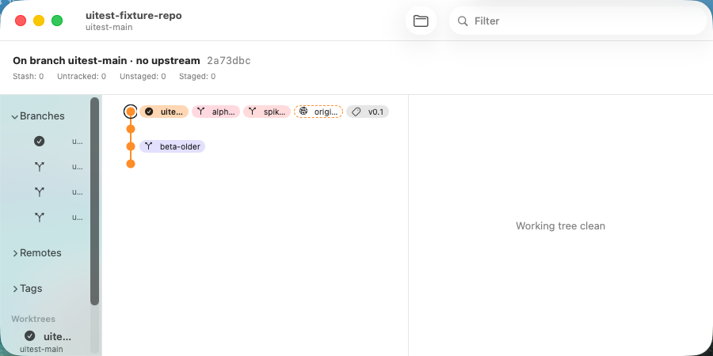
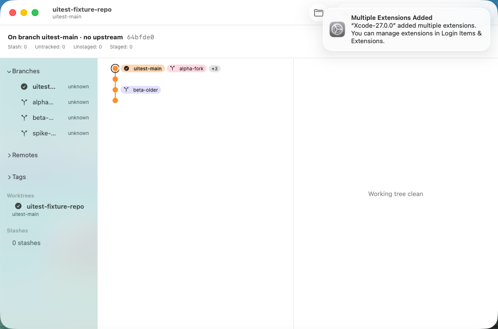
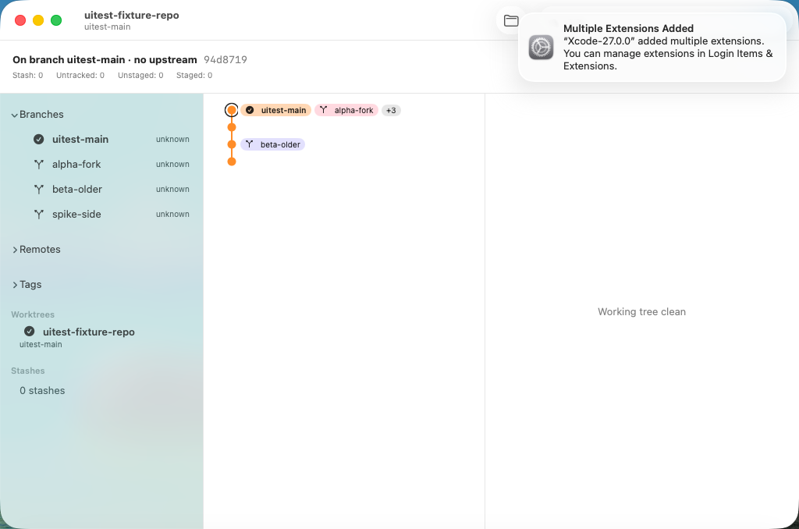

# 0409 — Branch chips truncate and the default window is too small to read the graph

| | |
|---|---|
| **Status** | resolved |
| **Module** | YardUI |
| **Milestone** | M9 |
| **Platform** | macOS |
| **First seen** | 2026-09-22 |
| **Branch** | `issue/0409` |
| **Commit** | `4371b88` |

## Description

Two problems show in the first VM screenshot of the M9 graph (#0400's
`Spike0400GraphScreenshotUITests`, 2026-09-22):



1. **Chips truncate.** The tip commit carries five refs, and they render as `uite…`, `alph…`,
   `spik…`, `origi…` and `v0.1`. A branch label that doesn't show the branch name defeats M9's
   goal ("all available local branches to be easy to browse").
2. **The default window is 900×450**, measured in both the VM screenshot and on the host earlier
   the same day. The sidebar gets squeezed until branch names show as `u…`, and the History pane
   is too narrow for a commit's chips.

## Expected behavior

- [ ] A chip never truncates its name. When a commit's chips don't fit the pane, they either wrap
      onto the next line or collapse into a "+N" chip whose help text lists the rest. The
      planning pass picks one and records why.
- [ ] A fresh main window opens large enough to read the graph: at least 1200×760, and the
      sidebar is wide enough to show a typical 11-character branch name (Batty's 0337 issue branch) in full.
- [ ] The #0400 VM screenshot test shows both.

## Plan (planning update, 2026-09-22)

**Decisions (Rule 12):**
- **Collapse, don't wrap.** A graph row is a fixed 22 pt (#0399), so wrapping would break the lane
  drawing. A row shows at most two chips at their full name, HEAD's first, then a `+N` chip whose
  help text names the rest. The row's accessibility label already lists every chip
  (`CommitRowAccessibility`), so nothing is lost for VoiceOver.
- **Size.** The main window opens at 1280×800. The pane minimums rise to sidebar 200, history 360
  and detail 280, which sum to a window minimum of 840.

### Files and literal changes

**`YardKit/Sources/YardUI/RefChips.swift`**: add inside `enum RefChips`:

```swift
    /// #0409: the chips a graph row shows at full width -- at most `limit`,
    /// the HEAD chip first -- and the rest, which the row folds into a
    /// "+N" chip. Order within each group is `make`'s display order.
    public static func split(_ chips: [RefChip], limit: Int = 2) -> (shown: [RefChip], hidden: [RefChip]) {
        let ordered = chips.filter(\.isHead) + chips.filter { !$0.isHead }
        return (Array(ordered.prefix(limit)), Array(ordered.dropFirst(limit)))
    }
```

**`YardKit/Sources/YardUI/CommitHistoryView.swift`**, in `CommitHistoryRow.body`, replace the
chips' `HStack(spacing: 4) { ForEach(chips, id: \.self) { chip in RefChipView(...) } }` with:

```swift
            HStack(spacing: 4) {
                let split = RefChips.split(chips)
                ForEach(split.shown, id: \.self) { chip in
                    RefChipView(chip: chip, tint: BranchColor.color(for: chip))
                        .fixedSize()
                }
                if !split.hidden.isEmpty {
                    // #0409: never truncate a name -- fold the rest into +N.
                    Text("+\(split.hidden.count)")
                        .font(.caption)
                        .padding(.horizontal, 6)
                        .padding(.vertical, 1)
                        .background(Capsule().fill(.quaternary))
                        .background(Capsule().fill(.background))
                        .fixedSize()
                        .help(split.hidden.map(\.name).joined(separator: ", "))
                }
            }
```

Its trailing `.opacity(...)` and `.padding(.leading, …)` modifiers stay.

**`YardKit/Sources/YardUI/PaneLayout.swift`**: change the three constants to
`sidebarMinWidth: CGFloat = 200`, `historyMinWidth: CGFloat = 360` and
`detailMinWidth: CGFloat = 280`. `windowMinWidth` stays the computed sum, now 840.

**`YardKit/Sources/YardUI/ContentView.swift`**, line 269: change
`.frame(minWidth: 480, minHeight: 360)` to `.frame(minWidth: PaneLayout.windowMinWidth, minHeight: 480)`.

**`Switchyard/SwitchyardApp.swift`**: on the main `WindowGroup(for: WindowID.self)`, add
`.defaultSize(width: 1280, height: 800)` directly after its `.handlesExternalEvents(matching: Set())`.

**`YardKit/Tests/YardUITests/PaneLayoutTests.swift`**: replace the last test
(`windowMinWidthFitsExistingContentViewMinimum`) with:

```swift
@Test("the window minimum is 840 pt, wide enough for a readable sidebar, graph and detail (#0409)")
func windowMinWidthIsReadable() {
    #expect(PaneLayout.windowMinWidth == 840)
    #expect(PaneLayout.sidebarMinWidth >= 200)
}
```

**`YardKit/Tests/YardUITests/RefChipsTests.swift`**: add inside `struct RefChipsTests`:

```swift
    @Test func splitShowsTwoChipsHeadFirstAndFoldsTheRest() {
        let head = RefChip(name: "main", kind: .localBranch, isHead: true)
        let a = RefChip(name: "alpha", kind: .localBranch, isHead: false)
        let b = RefChip(name: "beta", kind: .localBranch, isHead: false)
        let r = RefChip(name: "origin/main", kind: .remoteBranch, isHead: false)
        let split = RefChips.split([a, head, b, r])
        #expect(split.shown == [head, a])
        #expect(split.hidden == [b, r])
    }

    @Test func splitHidesNothingWhenTwoOrFewer() {
        let a = RefChip(name: "alpha", kind: .localBranch, isHead: false)
        #expect(RefChips.split([a]).hidden.isEmpty)
        #expect(RefChips.split([a]).shown == [a])
    }
```

### Verification

1. `cd YardKit && swift test`: baseline first. After the change all bundles pass and YardUITests
   is up by exactly 2, since one test is replaced and two are added.
2. From the worktree root:
   `xcodebuild build-for-testing -project Switchyard.xcodeproj -scheme 'Switchyard UITests' -destination 'platform=macOS' CODE_SIGNING_ALLOWED=NO CODE_SIGNING_REQUIRED=NO -derivedDataPath build/dd -quiet`
   has no `error:`. No UI tests on this Mac. The reviewer runs the VM suite and checks the #0400
   `graph` screenshot for untruncated chips, a `+N` chip and a wider window.

Mutation for the reviewer: change `chips.filter(\.isHead) + chips.filter { !$0.isHead }` to
`chips`. `splitShowsTwoChipsHeadFirstAndFoldsTheRest` must fail.

## Work log

- **2026-09-22, round 1 (Sonnet):** 90,687 subagent tokens, 607 s wall. Applied the plan with no
  deviations. YardUITests 268 → 270. It was green on the re-run; the first run hit the #0408
  GitProcessAsync flake. The UI-test target built. Committed `6f01f5d` on `issue/0409`.

## Review — round 1, 2026-09-22: partly met, round 2 needed

The full VM suite passed, including the #0400 screenshot test, and the `split` mutation is killed.
The round-1 screenshot:



- **Chips: met.** `uitest-main` and `alpha-fork` show in full, and the other three fold into `+3`.
- **Window: met.** It opens as large as the guest's 1024×768 screen allows (1024×678); on the
  host it opens at 1280×800.
- **Sidebar: not met.** `HSplitView` leaves the sidebar at its minimum (200 pt). With the
  trailing merged-state text ("unknown") beside every branch, names still truncate to `uitest…`
  and `alpha…`. The criterion asked for a typical branch name in full.

## Round 2 — literal changes

1. `YardKit/Sources/YardUI/PaneLayout.swift`: `sidebarMinWidth: CGFloat = 200` → `= 260`.
   `windowMinWidth` becomes 900.
2. `YardKit/Tests/YardUITests/PaneLayoutTests.swift`, in `windowMinWidthIsReadable`: change
   `#expect(PaneLayout.windowMinWidth == 840)` to `== 900` and `#expect(PaneLayout.sidebarMinWidth >= 200)`
   to `>= 260`.

Nothing else changes.

### Round 2 verification

`cd YardKit && swift test`: counts equal to round 1's (YardUITests 270), all passing. From the
worktree root,
`xcodebuild build-for-testing -project Switchyard.xcodeproj -scheme 'Switchyard UITests' -destination 'platform=macOS' CODE_SIGNING_ALLOWED=NO CODE_SIGNING_REQUIRED=NO -derivedDataPath build/dd -quiet`
has no `error:`. The reviewer re-runs the VM screenshot test and checks that the sidebar shows
`uitest-main` in full.

- **2026-09-22, round 2 (Sonnet):** 70,338 subagent tokens, 298 s wall. Applied both changes;
  suite green (YardUITests 270); UI-test target built. The reviewer also corrected the test's
  display name from 840 to 900 pt. Committed `4371b88`.

## Resolved — 2026-09-23

In the round-2 VM screenshot the sidebar shows every fixture branch in full, and the chips show
full names with `+3`:



Review:
- **VM suite, round 1:** all tests passed.
- **VM re-check, round 2:** the screenshot test passed.
- **Mutation:** ordering `split` by `chips` alone fails `splitShowsTwoChipsHeadFirstAndFoldsTheRest`.
- **Merge:** with `main` merged into the branch the suite was green (272). The squash is on `main`
  as `ad21fe4`. Merged `main` ran twice and was green both times.
- **Process slip:** `main` was pushed right after the squash, before those two runs finished,
  rather than after.
