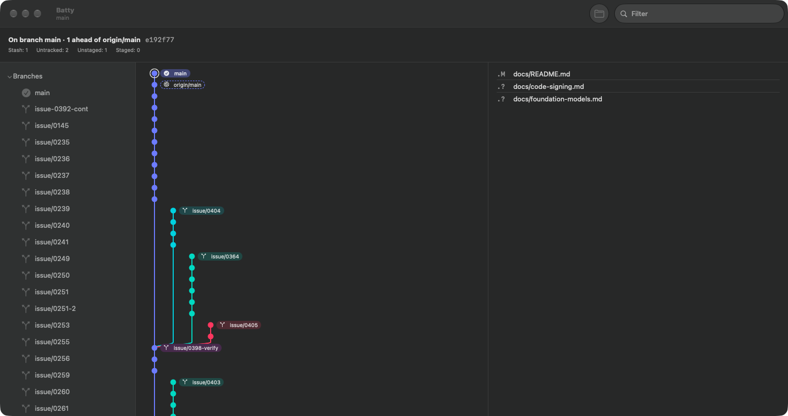

# 0410 — Branch tips don't line up along the top; you have to scroll down to find each branch

| | |
|---|---|
| **Status** | open |
| **Module** | YardUI |
| **Milestone** | M9 |
| **Platform** | macOS |
| **First seen** | 2026-09-23 |

## Description

After M9, Brennan tried the app on Batty. His words: *"see how the branches are not lining up
along the top where I would be able to see them. I have to keep scrolling down to get to them.
That goes against our design objective."*

What the reference shows, described in our own words (clean-room: GitUp is GPLv3, so nobody
reads its source; work only from this screenshot and this description):

- **Every branch tip sits on the same top row.** A glance across the top shows all branches at
  once, and no scrolling is needed to find one.
- **Each branch has its own column**, ordered left to right. `main`/HEAD is first; the rest
  appear to be ordered by recency.
- **Each branch's name is a slanted label above its column**, with `HEAD` and remote-tracking
  refs marked distinctly.
- **A branch's own commits run down its column from the top.** A connector then runs from the
  bottom of that run to the fork-point commit in the column it branched from, however far down
  that is. Connectors are long diagonals or elbows, not a row-by-row lane gutter.
- Merged or remote-only refs show as dashed connectors.

Today's History pane is a `List` of commits in `--topo-order` with a lane gutter. A branch's tip
appears at its row in that order, so tips spread down the whole history (#0399/#0400 labels sit
beside their node, but that node can be hundreds of rows down).

## Expected behavior

- [ ] Opening a repository shows every local branch's tip on one top row, with its name visible,
      without scrolling (horizontal scrolling is acceptable when there are more columns than fit).
- [ ] Each branch's own commits run down its column; a connector reaches its fork point.
- [ ] Selecting a node still drives the Detail pane; double-click still opens the changes window
      (#0406); the filter still dims non-matches (#0402); clicking a sidebar branch still
      focuses it (#0401).
- [ ] Every behaviour has a VM UI test, and a VM screenshot of a multi-branch fixture shows the
      aligned tips.

## Design (planning pass, 2026-09-23)

Written from the screenshot and the behaviour above only. Nobody opened GitUp's source.

**The model.** Rows are no longer a global topological order. They are positions inside a lane.

1. **One labelled lane per tip commit.** A tip is a commit named by a local branch, a
   remote-tracking branch (not `*/HEAD`) or a detached `HEAD`. Refs at the same commit share a
   lane, and its label shows the first two names then `+N`, the same fold as #0409.
2. **Lane order.** `HEAD`'s lane comes first. The other lanes with a local branch follow, most
   recent first, where recency is the tip's position in `--topo-order` (`CommitLogEntry` has no
   date, and topological position is the order the engine already returns). A lane that holds only
   remote-tracking refs sits right after the lane of its local namesake (`origin/feature` after
   `feature`), or at the end when it has none.
3. **Claiming.** Lanes claim history in that order. Each lane walks its tip's first-parent chain
   and takes every commit nobody took before it. Those are the lane's own commits, and they stack
   from **row 0** down, one per row. The first already-claimed commit the walk meets is the
   lane's fork point, and a **fork edge** runs from the run's last commit down its own lane to it.
4. **Stubs.** A lane whose tip an earlier lane already claimed has no commits of its own (the
   branch is behind, or was fast-forward merged). It draws a marker on row 0 and a dashed fork
   edge to its tip commit, so its name still sits on the top row.
5. **Unlabelled runs.** Commits no labelled lane claims (history merged in from deleted branches)
   form runs that start one row below the lowest child pointing at them. They pack into shared
   tracks right of the labelled lanes, and a track is reused once the previous run's rows and its
   fork edge have ended.
6. **Edges.** A first parent on the next row of the same lane is a chain (straight vertical). A
   fork runs down its own lane and turns into the fork point half a row above it. A merge turns
   into the parent's lane half a row below the merge and runs down to the parent. Edges into
   history no local tip reaches are dashed (#0368).

**Measured on the real repositories (2026-09-23, planning prototype, `BranchMapLayout.make`):**

| repository | rows | labelled lanes | stubs | tips on row 0 | lanes incl. tracks | row count | layout time |
|---|---|---|---|---|---|---|---|
| Batty | 2,071 | 128 | 7 | **121 of 121** non-stub | 129 | 1,186 | 9 ms |
| git/git (5,000 loaded) | 5,000 | 8 | 2 | 6 of 6 | 130 | 2,577 | 14 ms |

Batty is what M9 is about: every branch tip sits on the top row. git/git is merge-heavy, so its
topic branches become 122 unlabelled tracks. That width is honest (about 4,700 pt, scrolled
horizontally), but a narrower track spacing is a candidate follow-up if it bothers anyone.

**Decisions (Rule 12):**

- **Replace the List, no toggle.** The map is the design objective, and a toggle would double the
  VM test surface. `CommitHistoryView` keeps its public `init` so `ContentView` does not change.
- **Refs at one commit share a lane** rather than each getting a column. Separate columns for the
  same commit would draw N−1 horizontal dashes on the top row, and a shared lane is what the
  screenshot shows for `main` and `origin/main` at one commit.
- **Tags get no lane.** They open lanes for old releases (the same reason #0364 does not walk
  `--tags`). They still ride in each commit's accessibility label and match the filter.
- **Drawing is virtualised.** A `LazyVStack` of one-row `Canvas` strips sits in a 2-D
  `ScrollView`, with the labels in a pinned section header. One `Canvas` for 2,577 rows would be a
  layer about 62,000 pt tall. Each strip draws only the edges `BranchMapGeometry.edgesByRow` lists
  for it.
- **Each commit is a 22 pt square target** carrying the tap, double-click, context menu and
  accessibility element, with the label `CommitRowAccessibility.label` that #0399's rows spoke. So
  `historyRows(containing:)` and VoiceOver keep working unchanged.
- **Scroll-to is point-based** (`ScrollPosition.scrollTo(point:)`), computed from the layout and
  clamped to the content. An id-based `scrollTo` cannot reach a node inside a strip that has not
  been realised, and cannot centre a lane horizontally.

**Children** (milestone M9, each one deliverable, code in the issue):

| # | deliverable |
|---|---|
| #0411 | `BranchMapLayout`: lanes, rows, edges, plus unit tests |
| #0412 | `BranchMapGeometry`: points, polylines, per-row strips, scroll offset, plus unit tests |
| #0413 | `BranchMapView`: strips, pinned slanted labels, node targets. Not yet wired in |
| #0414 | `CommitHistoryView` renders the map in place of the List, and the existing VM tests migrate |
| #0415 | A multi-branch VM fixture, plus VM tests for aligned tips, labels and scroll-to-far-branch |

## Notes

Planning is delegated to a design subagent (2026-09-23). The umbrella gets split into
code-level children.
