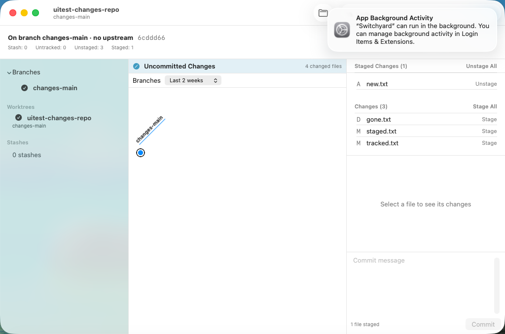
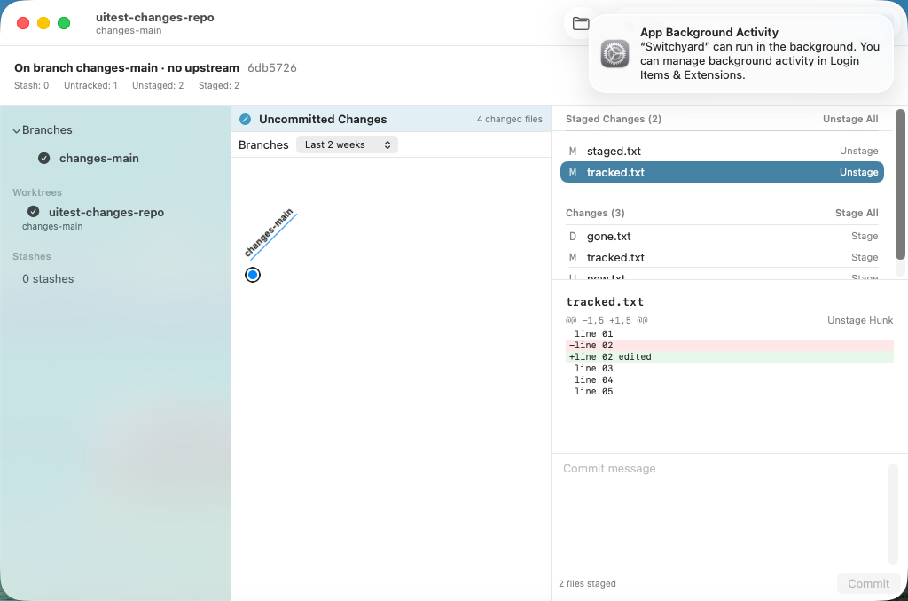
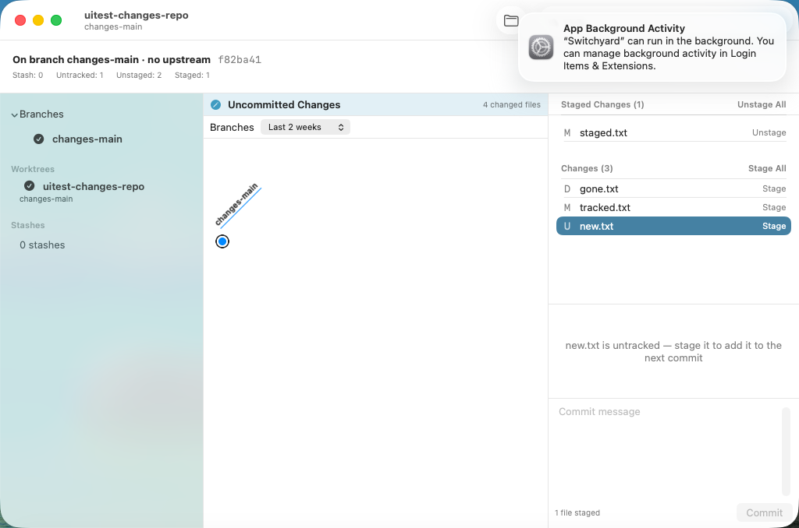
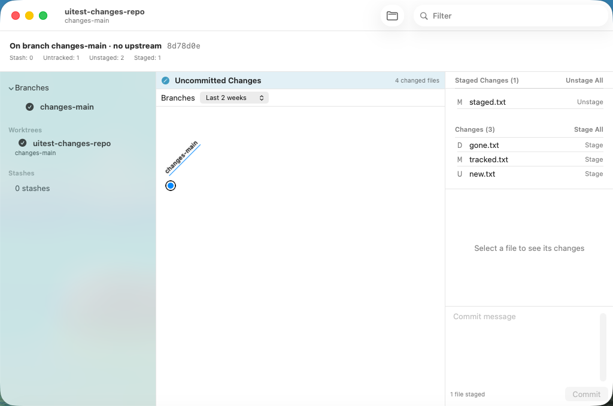

# 0437 — Staging and committing from the app (umbrella)

| | |
|---|---|
| **Status** | resolved |
| **Module** | YardUI |
| **Milestone** | — |
| **Platform** | macOS |
| **First seen** | 2026-09-28 |
| **Children** | #0438, #0439, #0440, #0441, #0442, #0443, #0444, #0445, #0446, #0447, #0448 |

## Description

The app browses history and edits it (context-menu history edits, journaled undo and redo), but a
user cannot stage a change or make a commit. The engine already had the hunk layer (`listHunks`,
`stageHunks`, `unstageHunks`, stable ids), `gitStatus`, `CommitCreate.run` (a `git commit -m`
shell-out, so hooks run and signing is honoured) and `commitHunks`. It had **no whole-file stage or
unstage**, and **no journaled commit of the index as it stands**: `CommitCreate.run` writes no
checkpoint, by design. The app's only use of either was the review sheet's `stagePatch`. The
Detail pane with nothing selected showed a read-only `StatusRow` list.

**Guide §11 decision 30** is the design. In short: the Detail pane's **Changes view** replaces that
list. It has Staged Changes and Changes lists with per-file and all-files buttons, the selected
file's diff with per-hunk buttons, and a message editor with **Commit** (⌘↩). A pinned
**Uncommitted Changes** row above the branch map brings it back. Every mutation is one journal entry,
so Edit ▸ Undo reverts it, and failures show git's stderr in an alert.

## Children, in dispatch order

| # | deliverable | files |
|---|---|---|
| #0438 | Engine: `stagePaths`, journaled `git --literal-pathspecs add -A` | `YardGit/PathStaging.swift` (new), `Tests/YardGitTests/PathStagingTests.swift` (new) |
| #0439 | Engine: `unstagePaths`, journaled `git --literal-pathspecs reset -q` | the same two files, appended |
| #0440 | Engine: `commitStaged`, `CommitCreate.run` inside one checkpoint | `YardGit/Staging.swift`, `Tests/YardGitTests/CommitStagedTests.swift` (new) |
| #0441 | YardUI data layer: `WorkingChanges` partition, `WorkingDiffs`, `WorkingChange` + loaders, Undo titles | `YardUI/WorkingChanges.swift` (new), `YardUI/JournalMenu.swift`, `Tests/YardUITests/WorkingChangesTests.swift` (new) |
| #0442 | VM fixture: a dirty working tree | `scripts/uitest-fixtures/make-changes-fixture.sh` (new), `scripts/run-ui-tests-vm.sh`, `SwitchyardUITests/UITestSupport.swift` |
| #0443 | Changes view: the two lists, per-file Stage/Unstage, mounted in the Detail pane | `YardUI/WorkingChangesView.swift` (new), `YardUI/ContentView.swift`, delete `YardUI/StatusRow.swift`, VM test |
| #0444 | Selected file's diff with Stage Hunk / Unstage Hunk | `YardUI/WorkingChangesView.swift`, `YardUI/FileDiffView.swift`, `YardUI/ContentView.swift`, VM test |
| #0445 | Commit message editor and Commit (⌘↩) | `YardUI/WorkingChangesView.swift`, `YardUI/ContentView.swift`, VM test |
| #0446 | Uncommitted Changes row above the branch map | `YardUI/WorkingChangesRow.swift` (new), `YardUI/ContentView.swift`, test, VM test |
| #0447 | Refresh in place when the window becomes active | `YardUI/ContentView.swift`, VM test |
| #0448 | **Bug, prerequisite for #0445:** Edit ▸ Undo never reaches the journal | `YardUI/JournalMenu.swift`, test, VM test |

**Order.** #0448 is independent: it touches `JournalMenu.swift` in a different place from #0441's
three lines and adds its own spike. Dispatch it first or alongside anything; it must merge before
#0445. #0438 → #0439 → #0440 are engine-only and serial: #0439 appends to #0438's files. #0442
touches only scripts and `UITestSupport.swift`, so it can run beside any engine child. #0441 needs
#0438–#0440 merged. #0443 needs #0441 and #0442. #0444 and #0445 both edit
`WorkingChangesView.swift`, so run them one at a time after #0443: #0444, then #0445. #0446 and #0447
each edit different lines of `ContentView.swift`. Run them after #0445, one at a time. Every UI
child adds one `run_spike_if_selected` line after the previous child's line.

## Expected behavior

- [ ] #0438–#0448 resolved and merged.
- [ ] On `main`, `./scripts/run-ui-tests-vm.sh` passes every spike, including 0443–0448. The
      `changes-*` screenshots are attached here.

## Questions for Brennan (the plan assumed an answer to each; none blocks a child)

1. **Amend.** Not in this umbrella. GitUp-style clients offer "Amend HEAD" beside Commit. Assumed:
   a later issue. The history's Edit Message covers rewording.
2. **Discard changes.** A "Discard" per file or hunk is destructive to the worktree. The journal
   captures the worktree only for operations that disturb it (guide §7), so discard would need a
   worktree snapshot before it could be undoable. Assumed: out of scope until that exists.
3. **Hooks and `PATH`.** A Finder-launched app gets launchd's minimal `PATH`
   (`/usr/bin:/bin:/usr/sbin:/sbin`). A `pre-commit` hook that calls Homebrew or `npx` tools fails in
   the app while it passes in a terminal. Git clients commonly read the login shell's `PATH` once at
   launch. Assumed: out of scope. The hook's failure is shown verbatim, so the user can see the
   cause.
4. **Signing override.** Commit uses `.config`, so `commit.gpgsign` decides. Assumed: no per-commit
   sign/no-sign toggle in the UI.
5. **Line-level staging** (part of a hunk). Assumed: later. Hunk and file granularity cover the
   common case, and `stagePatch` is the primitive a line picker would need.
6. **A commit while a merge is in progress.** `git commit` concludes the merge (it reads
   `MERGE_HEAD`), and the header's Continue does the same. Assumed: allowed. Commit is disabled only
   while conflicted paths remain.

## Work log

- 2026-09-28 planned (Opus): guide §11 decision 30 committed. Every child's code was prototyped
  together in the planning worktree `../sy-plan-0437` (detached, never pushed). Measurements are in
  each child.
- 2026-09-28 planning VM runs on the whole prototype (`./scripts/run-ui-tests-vm.sh <spike>`, one
  clone each, after checking `tart list` for foreign clones): spikes **0443, 0444, 0445, 0446, 0447
  and 0448 all ended `RESULT: TEST SUCCEEDED`**. Planning found and fixed three defects on the way:
  path-only row ids (0444 failed, fixed in #0441), Edit ▸ Undo never reaching the journal (0445 failed in
  the prototype, 0448 on unpatched `main`; filed as **#0448**), and undo moving a `nil` selection to `HEAD`
  (0445 failed, fixed in #0443). Negative control: 0447 fails with its refresh line removed.
- 2026-09-28 full suite on the prototype: 162/346/381/1059/14/122, all green, against `main`'s
  162/337/381/1048/14/122. That is +11 in the `YardGitTests` bundle (#0438 4, #0439 4, #0440 3) and
  +9 in the `YardUITests` bundle (#0441 7, #0446 1, #0448 1). The UI-test target built unsigned.
  Every child's diff was applied in sequence to `main`'s files, and the result was byte-identical to
  the prototype; each stage compiled (`../sy-plan-0437c`).

- 2026-09-28: all children (#0438-#0448) resolved and merged. The final full VM run on #0447's branch (main plus #0447) passed every spike. The umbrella's questions for Brennan stand, with the assumptions as recorded.
