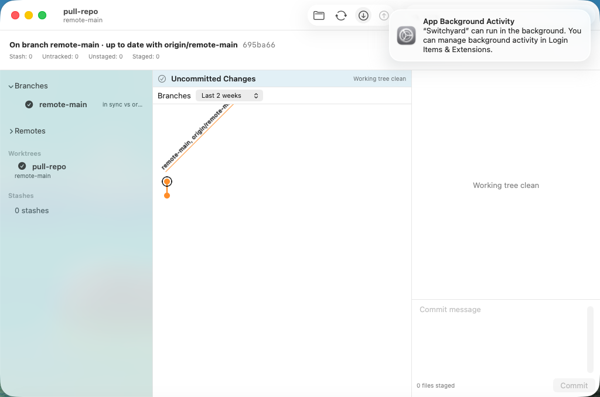
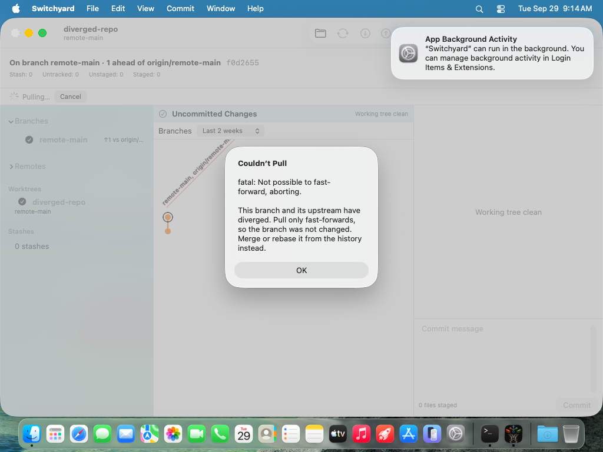
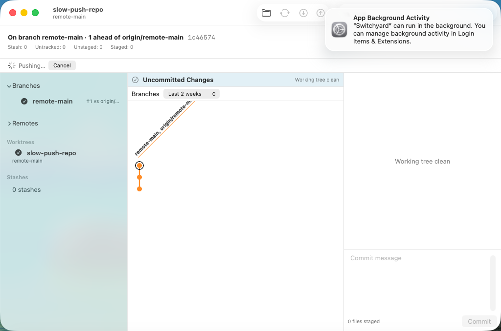
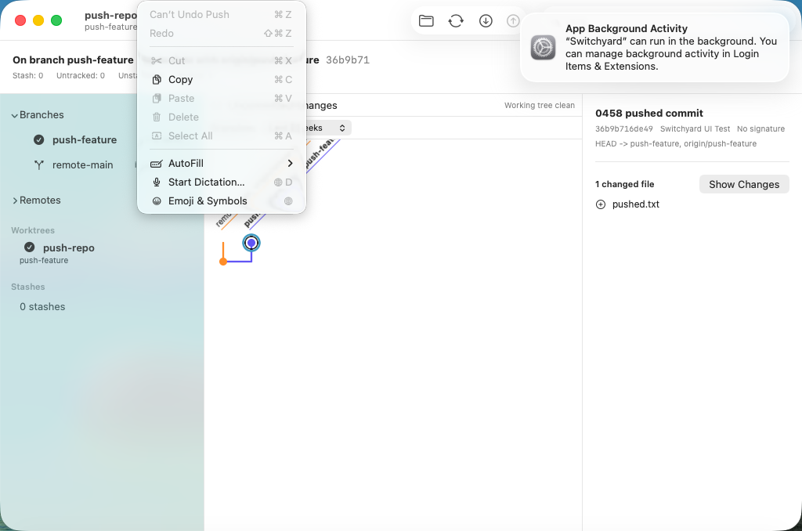

# 0450 — Fetch, Pull and Push from the app (umbrella)

| | |
|---|---|
| **Status** | open |
| **Module** | YardUI |
| **Milestone** | — |
| **Platform** | macOS |
| **First seen** | 2026-09-29 |
| **Children** | #0452, #0453, #0454, #0455, #0456, #0457, #0458, #0459 |

## Description

The app browses, edits history, stages and commits, but it cannot talk to a remote. The README lists
network operations under "Not there yet". The engine has no fetch, pull or push at all: the only
`git push` in `YardGit` is `FixtureRepository.addUpstream`, a test helper.

**Guide §11 decision 32** is the design. In short: **Fetch**, **Pull** and **Push** in the window
toolbar, for the current branch. Pull is fast-forward only (`git merge --ff-only @{upstream}` after a
fetch, never `git pull`). Push goes to the upstream with an explicit refspec, or sets one on the
first push; it never forces. Nothing prompts: a missing credential is an alert with git's stderr.
The progress line has **Cancel**. Fetch and Pull are journaled before they run, so Edit ▸ Undo Fetch
and Undo Pull work. Push is journaled after it succeeds, and Edit ▸ Undo reads **"Can’t Undo
Push"**, disabled.

## Children, in dispatch order

| # | deliverable | files |
|---|---|---|
| #0452 | Engine: `RemoteSync.fetch` (journaled `git fetch --all`), `remoteNames`, `Refusal`, shared probes | `YardGit/RemoteSync.swift` (new), `Tests/YardGitTests/RemoteSyncTests.swift` (new), two `YardWireTests` coverage rows |
| #0453 | Engine: `RemoteSync.pull`, fetch then `merge --ff-only @{upstream}`, journaled | the same two files, appended |
| #0454 | Engine: `RemoteSync.push`, explicit refspec, `--set-upstream` on first push, entry written after success | the same two files, appended |
| #0455 | VM fixture: a bare remote and four clones | `scripts/uitest-fixtures/make-remote-fixture.sh` (new), `scripts/run-ui-tests-vm.sh`, `SwitchyardUITests/UITestSupport.swift` |
| #0456 | YardUI data layer: `RemoteOperation` rules, alerts, loaders; Undo Fetch / Undo Pull titles | `YardUI/RemoteOperations.swift` (new), `YardUI/JournalMenu.swift`, `Tests/YardUITests/RemoteOperationsTests.swift` (new) |
| #0457 | Toolbar Fetch / Pull / Push with progress, alerts and refresh | `YardUI/ContentView.swift`, VM spike 0457 (two classes) |
| #0458 | Cancel on the progress line | `YardUI/ContentView.swift`, VM spike 0458 |
| #0459 | Edit ▸ Undo after a push reads "Can’t Undo Push", disabled | `YardUI/JournalMenu.swift`, `YardUI/ContentView.swift`, `Tests/YardUITests/JournalMenuTests.swift`, VM spike 0459 |

**Order.** #0452 → #0453 → #0454 are engine-only and serial, because each appends to the same two
files. #0455 touches only scripts and `UITestSupport.swift`, so it can run beside any engine child.
#0456 needs #0454 merged. #0457 needs #0455 and #0456. #0458 and #0459 both edit `ContentView.swift`
and each appends its spike line after the previous child's, so run them one at a time after #0457:
#0458, then #0459. Every child's text was generated from the planning prototype. Applied in this
order to `main`, the result compiled at every stage and was byte-identical to the prototype (see the
work log).

## Questions for Brennan (the plan assumed an answer to each; none blocks a child)

1. **The Finder `PATH` for helpers and hooks.** A Finder-launched app gets
   `PATH=/usr/bin:/bin:/usr/sbin:/sbin` (measured). SSH through the agent and HTTPS through
   `osxkeychain` both work, but a credential helper that is not an absolute path (`!gh auth
   git-credential`) or Git LFS's `pre-push` hook (`git-lfs` from Homebrew) fails in the app while it
   works in a terminal. This is #0437's question 3 again. Assumed: still out of scope; the failure
   alert shows git's stderr, which names the missing command. One fix would cover commits and
   pushes: read the login shell's `PATH` once at launch, or append `/opt/homebrew/bin:/usr/local/bin`.
2. **Fetch scope.** Fetch runs `git fetch --all` (every remote), not only the current branch's
   remote. Assumed: all remotes, because it is cheap and matches what a GUI "Fetch" usually means.
   Pull fetches only the upstream's remote.
3. **Prune.** No `--prune`; the user's `fetch.prune` decides. Assumed: respect config.
4. **Where Push goes.** Always the upstream, or `origin` (or the only remote) on the first push.
   `branch.<name>.pushRemote` and `remote.pushDefault` (triangular workflows) are ignored. Assumed:
   fine for now, and cheap to add in `RemoteSync.push`.
5. **Undo stops at a push.** After a push, Edit ▸ Undo is disabled until another operation is
   journaled, so undoing past a published commit is impossible from the app. Assumed: correct. The
   alternative, "Undo (local only)" with a warning, is a small change to `JournalMenu.undoBlocked`
   if you want it. **The CLI's `switchyard undo` is not blocked**: it restores the push marker (a
   no-op) and then the entry before it, rewinding `origin/<branch>` locally. Should the engine
   refuse too? That would be engine hardening, which the priority section defers, so it is not in
   this umbrella.
6. **Force push, pull with rebase or merge, and CLI verbs** (`switchyard fetch/pull/push`) are out of
   scope. Assumed: later issues if wanted.
7. **Progress detail.** The progress line says only "Fetching…" with a spinner. `GitProcess` sends
   stderr to a file, so git's `--progress` percentages are not streamed. Assumed: enough for the MVP.

## Expected behavior

- [ ] #0452–#0459 resolved and merged.
- [ ] On `main`, `./scripts/run-ui-tests-vm.sh` passes every spike, including 0457 (both classes),
      0458 and 0459. The `remote-*` screenshots are attached here.

## Work log

- 2026-09-29 planning (Opus) started: guide §11 decision 32 written; prototype in the detached
  worktree `../sy-plan-0450`.
- 2026-09-29 environment measurement (decision 32): a script bundle launched **through Finder**
  (`osascript … tell application "Finder" to open`) recorded `PATH=/usr/bin:/bin:/usr/sbin:/sbin`,
  `SSH_AUTH_SOCK` set (the same socket `launchctl getenv SSH_AUTH_SOCK` reports), `ssh-add -l`
  listing the agent's keys, `credential.helper=osxkeychain` from Xcode's system gitconfig, and
  `tty` → `not a tty`. Launching the same bundle with `open` from a terminal is **not** a valid
  measurement: that inherited the whole shell environment.
- 2026-09-29 engine prototype: `RemoteSyncTests` (16 tests) green in both ref formats. Ten mutations
  were applied, and each was seen to fail its test (listed in #0452–#0454). Measured on the way: an
  unjournaled `git fetch` followed by Undo Commit silently rewinds `origin/main`, which is why fetch
  gets its own entry (decision 32).
- 2026-09-29 planning VM runs (`./scripts/run-ui-tests-vm.sh <n>`, one clone each, `tart list`
  checked first): **0457 (fetch-pull and refused), 0458 and 0459 all ended `RESULT: TEST
  SUCCEEDED`**. The first 0457 run failed twice, and both fixes are in #0457's text: Undo Pull keeps the
  fetched commit in History, and `buttons["OK"]` matched the Touch Bar. The first 0459 run exported
  a `HEAD` without the fixture script (the export is `git archive HEAD`, so a planning prototype must
  commit first). That run's failure left its clone running with the trap not firing, and I stopped
  and deleted it by hand. **Negative control:** 0459 with `undoBlocked` removed failed with `the Edit
  menu does not say Can’t Undo Push`.
- 2026-09-29 sequence check: every child's edits were generated from the prototype and applied to
  `main` (52749615) in dispatch order in `../sy-plan-0450c`. `swift build --build-tests` passed after
  each child. The result matched the prototype byte for byte, except #0458's rewritten progress-line
  comment. The full suite ran twice there, green both times: 162/358/399/1075/14/122, against
  `main`'s 162/346/399/1059/14/122 (+12 `YardUITests`: #0456 10, #0459 2; +16 `YardGitTests`: #0452
  5, #0453 5, #0454 6). The UI-test target built unsigned (`** TEST BUILD SUCCEEDED **`).

- 2026-09-29 **renumbered**: the children were first written as #0451–#0458. Another session filed
  #0451 on `main` while this pass was running, so every child moved up by one to #0452–#0459. That
  covers the spike numbers, class names, fixture commit subjects and code comments, all of which the
  prototype renumbered and re-ran. After the renumbering: VM spikes **0457 (both classes), 0458 and
  0459 ended `RESULT: TEST SUCCEEDED`**. The sequence check on `main` 52749615 built after each
  child, and the full suite ran twice, green both times (162/358/399/1075/14/122).
