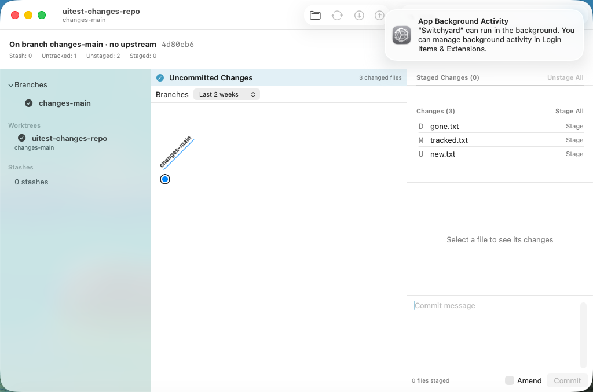
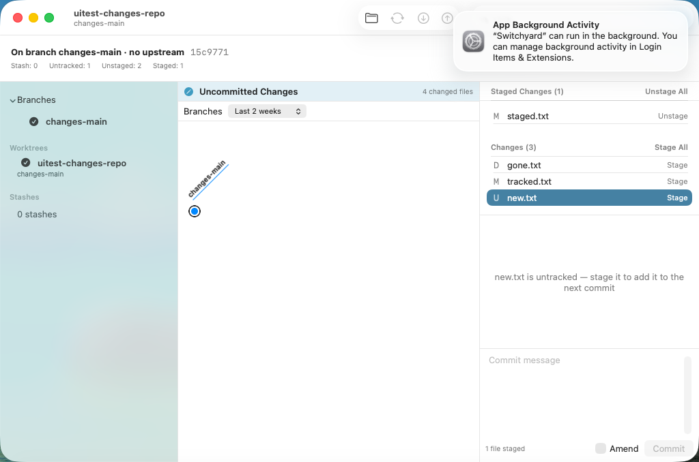
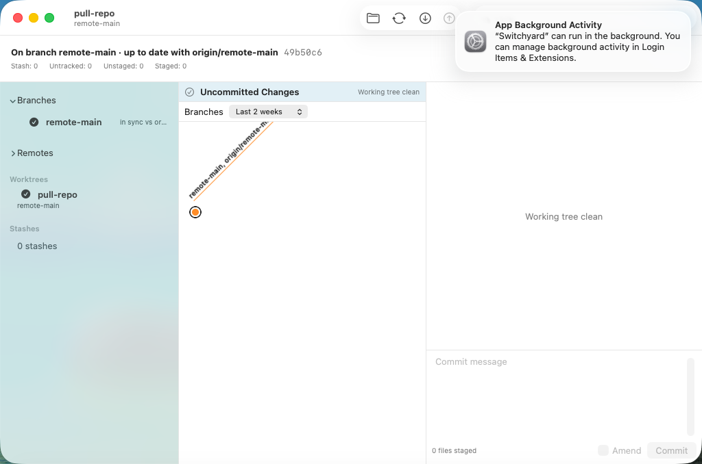

# 0462 — Amend the last commit from the Changes view (umbrella)

| | |
|---|---|
| **Status** | open |
| **Module** | YardGit, YardUI |
| **Milestone** | — |
| **Platform** | macOS |
| **First seen** | 2026-09-29 |
| **Children** | #0463, #0464, #0465, #0466 |
| **Related** | #0437 (question 1, amend deferred), #0450 (push never forces), #0461 (engine-side guards) |

## Description

The Changes view (guide §11 decision 30, #0437) commits the index, but a user cannot fix the commit
they just made: a forgotten file or a typo in the message means a second commit or a trip through
the history's Edit Message, which cannot add files. #0437 deferred amend as its question 1.

**Guide §11 decision 33** is the design. In short: an **Amend** checkbox beside **Commit**. Turning
it on fills the message editor with `HEAD`'s message (the draft is set aside and comes back when it
is turned off); the button then reads **Amend** and runs `git commit --amend -m`, so hooks run and
signing follows config. It is one journal entry, so Edit ▸ **Undo Amend** restores the old commit
and the index. Amend is refused, in the engine and in the UI, when the branch has no commits or
when `HEAD` is already on any remote-tracking branch, because the rewrite would need a force-push,
which the app never does. A merge commit may be amended. Nothing staged is allowed: a message-only
amend.

## Children, in dispatch order

| # | deliverable | files |
|---|---|---|
| #0463 | Engine: `AmendHead.target` — HEAD, its message, and the refusal | `YardGit/AmendHead.swift` (new), `Tests/YardGitTests/AmendHeadTests.swift` (new), the two coverage registries |
| #0464 | Engine: `AmendHead.run` — journaled `git commit --amend -m` | `YardGit/AmendHead.swift`, `YardGit/CommitCreate.swift`, `Tests/YardGitTests/AmendHeadTests.swift` |
| #0465 | YardUI data layer: `CommitDraft`, `WorkingChange.amend`, the blocked reasons, `loadAmendTarget`, the Undo title | `YardUI/WorkingChanges.swift`, `YardUI/JournalMenu.swift`, `Tests/YardUITests/WorkingChangesTests.swift` |
| #0466 | The Amend checkbox and button in the Changes view, wired in `ContentView`, VM test | `YardUI/WorkingChangesView.swift`, `YardUI/ContentView.swift`, `SwitchyardUITests/0466AmendUITests.swift` (new), `scripts/run-ui-tests-vm.sh` |

**Order.** Strictly serial: #0463 → #0464 (appends to #0463's files) → #0465 (calls both) → #0466
(uses #0465's types). **#0465 edits `JournalMenu.swift`'s title table**, one line after `"push"`;
#0461 (in progress when this was planned) edits the same file lower down (`undoBlocked`). Dispatch
#0465 only after #0461 is merged, and merge `main` into its branch first. The changes fixture
(#0442) is reused unchanged: its one commit, `changes base commit`, has no remote, so it can be
amended.

## Expected behavior

- [ ] #0463–#0466 resolved and merged.
- [ ] On `main`, `./scripts/run-ui-tests-vm.sh 0466` passes; the `changes-amend-*` screenshots are
      attached here.

## Questions for Brennan (the plan assumed an answer to each; none blocks a child)

1. **Pushed means *any* remote-tracking branch contains `HEAD`**, not only its upstream. Assumed:
   any, because a new branch cut from `origin/main` has no upstream but its `HEAD` is published.
   The cost: a stale remote-tracking ref (a remote branch deleted since the last fetch) can block
   an amend until the next Fetch.
2. **Merge commits may be amended.** Assumed: yes. `--amend` keeps both parents and the journal
   undoes it. The history's rewrites refuse merges only because a replay would lose a parent.
3. **Prefill replaces the draft.** Turning Amend on sets the draft aside and shows `HEAD`'s message;
   turning it off restores the draft. An alternative is to keep a non-empty draft. Assumed: replace,
   which is what the checkbox's name promises.
4. **Author.** `--amend` keeps `HEAD`'s author and author date (git's rule). Assumed: no "reset
   author" option.
5. **An amend that would leave an empty commit** fails with git's own message; `--allow-empty` is
   not passed. Assumed: the alert is enough.
6. **A pushed `HEAD` could offer "Amend and force-push".** Assumed: never; decision 32 rules out
   force-push, and this plan keeps it out.

## Work log

- 2026-09-29 planned (Opus): guide §11 decision 33 committed. Code prototyped in the planning
  worktree `../sy-plan-amend` (detached, never pushed).
- 2026-09-29 the whole prototype (#0463–#0466 applied in order on `main` at 080d1bae, then `main`
  merged in with #0461) passed the full suite: `Test run with` 162 / **363** / 399 / **1085** / 14 /
  122, against 162 / 358 / 399 / 1077 / 14 / 122 on `main` after #0461 — +5 in the `YardUITests`
  bundle (#0465) and +8 in the `YardGitTests` bundle (#0463 4, #0464 4), nothing else moved.
- 2026-09-29 planning VM runs (`./scripts/run-ui-tests-vm.sh 0466`, after checking `tart list`
  for foreign clones): the first run failed only on `button.title`, which reads `""` in the guest;
  #0466 now uses `button.label`. The second run: **`spike-0466-amend` and `spike-0466-pushed` both
  `TEST SUCCEEDED`**. Negative control: with `amendUnavailableReason` returning `nil` in place of
  the refusal, `spike-0466-pushed` failed ("Amend is enabled on a commit that is already on
  origin") while `spike-0466-amend` still passed.

