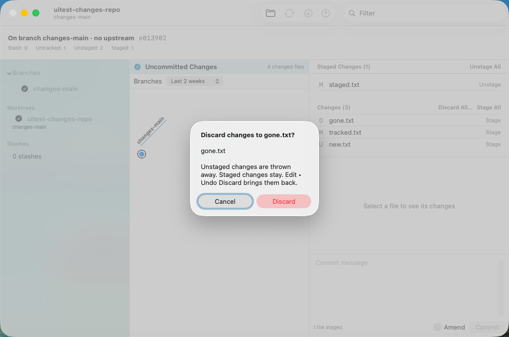
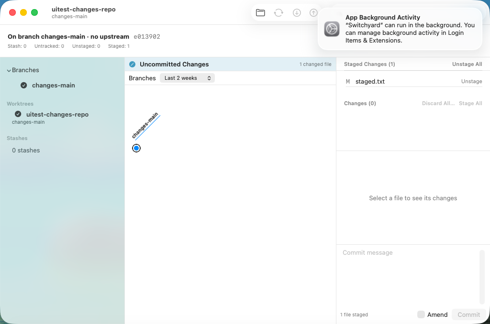
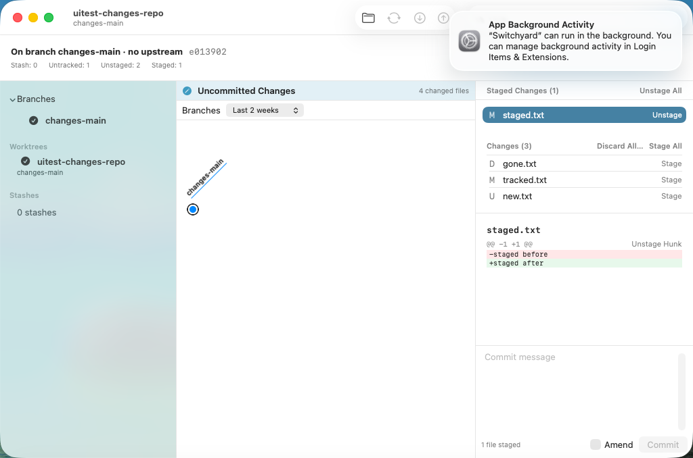
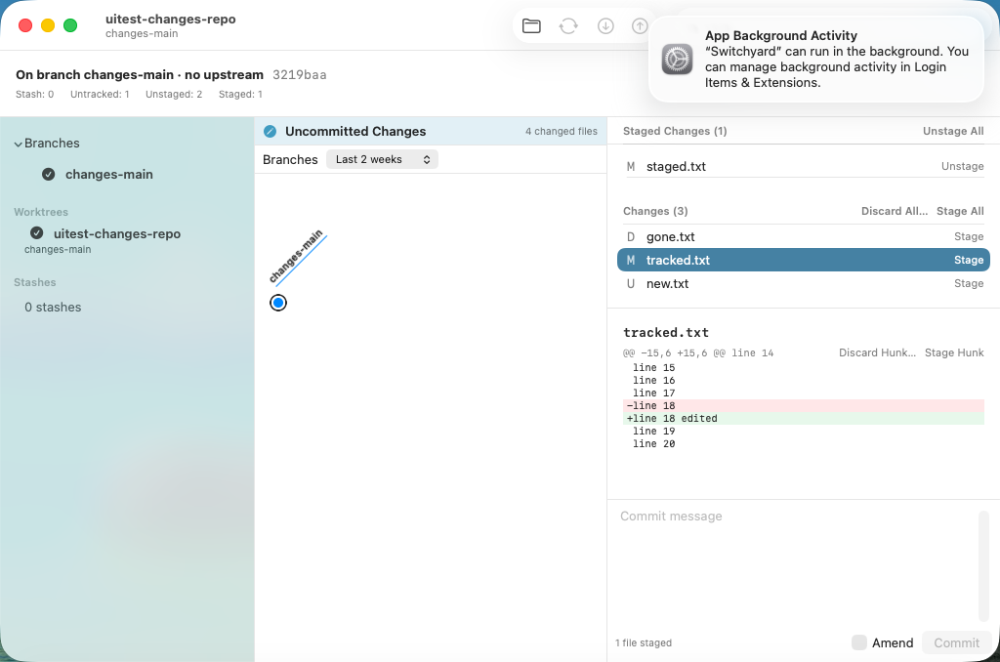

# 0467 — Discard changes from the Changes view, undoably (umbrella)

| | |
|---|---|
| **Status** | open |
| **Module** | YardGit, YardUI |
| **Milestone** | — |
| **Platform** | macOS |
| **First seen** | 2026-09-29 |
| **Children** | #0468, #0469, #0470, #0471, #0472 |
| **Related** | #0437 (question 2, discard deferred), #0462 (Amend, same view), #0359 (destructive-dialog rule) |

## Description

The Changes view (guide §11 decision 30) stages, commits and amends. It cannot throw away an edit.
A user who wants a file back as it was has to go to a terminal. #0437 deferred discard as its
question 2, on the belief that the journal would first need a worktree snapshot.

**It already has one.** Every `JournalCheckpoint.checkpoint` captures `WorktreeSnapshot`: tracked
worktree bytes and modes, deletions, and untracked non-ignored files. Every restore applies it. The
planning prototype measured Undo after a discard returning text, binary, an executable bit, a
symlink, a deleted file, untracked files and an untracked directory byte for byte. So Discard is
one `JournalCheckpoint.around(operation: "discard")`, with no journal change.

**Guide §11 decision 34** is the design. In short: **Discard Changes…** on each unstaged row (context
menu), **Discard All…** on the Changes header, and **Discard Hunk…** on each unstaged hunk. Each opens
a confirmation dialog that names what goes. A tracked file goes back to its index version (`git
restore --worktree`), so staged changes are never touched. An untracked file is deleted with `git
clean -f`, which leaves ignored files alone; it is not moved to the Trash. The engine refuses
conflicted, intent-to-add, nested-repository and submodule paths before writing anything. Edit ▸
**Undo Discard** brings it all back.

## Children, in dispatch order

| # | deliverable | files |
|---|---|---|
| #0468 | Engine: `DiscardChanges.discardPaths`, the refusals, journaled | `YardGit/DiscardChanges.swift` (new), `Tests/YardGitTests/DiscardChangesTests.swift` (new), the two coverage registries |
| #0469 | Engine: `DiscardChanges.discardHunks`, `git apply --reverse`, journaled | the same two files, appended |
| #0470 | YardUI data layer: `WorkingChange.discardFiles`/`.discardHunk`, `DiscardConfirmation`, `canDiscard`, the Undo title | `YardUI/WorkingChanges.swift`, `YardUI/JournalMenu.swift`, `Tests/YardUITests/WorkingChangesTests.swift` |
| #0471 | Changes view: Discard Changes… per row, Discard All…, the confirmation dialog, VM test | `YardUI/WorkingChangesView.swift`, `SwitchyardUITests/0471DiscardFilesUITests.swift` (new), `scripts/run-ui-tests-vm.sh` |
| #0472 | Diff pane: Discard Hunk… per unstaged hunk, VM test | `YardUI/FileDiffView.swift`, `YardUI/WorkingChangesView.swift`, `SwitchyardUITests/0472DiscardHunkUITests.swift` (new), `scripts/run-ui-tests-vm.sh` |

**Order.** Strictly serial. #0468 → #0469 (appends to #0468's files) → #0470 (calls both) → #0471 (uses
#0470's types) → #0472 (edits `WorkingChangesView.swift` after #0471, and adds its spike line after
#0471's). #0466 (Amend) is merged (9469eda1). It edited `WorkingChangesView.swift` too, and #0471's text is written against it. #0468–#0470 do
not touch any file #0466 does. No child edits `ContentView.swift`: `runWorkingChange` already runs
any `WorkingChange` and refreshes. The changes fixture (#0442) is reused unchanged. Its `tracked.txt`
(two unstaged hunks), `gone.txt` (deleted), `new.txt` (untracked) and `staged.txt` (staged only) are
the cases the spikes need.

## Expected behavior

- [ ] #0468–#0472 resolved and merged.
- [ ] On `main`, `./scripts/run-ui-tests-vm.sh 0471` and `./scripts/run-ui-tests-vm.sh 0472` pass;
      the `changes-discard-*` screenshots are attached here.

## Questions for Brennan (the plan assumed an answer to each; none blocks a child)

1. **Undo Discard rewinds everything since the discard, not only the discarded files.** Every Undo
   restores the entry's whole worktree snapshot (measured: discard `a.txt`, edit `b.txt`, create
   `c.txt`, Undo → `b.txt`'s edit and `c.txt` are gone; Redo brings them back). This is how every
   Undo already works, including Undo Stage. Discard makes it likelier to bite, because people edit
   after discarding. Assumed: keep the journal's contract. The alternative is a path-scoped restore
   for discard entries: new journal work, which the priority section says to hold. Worth a
   decision before this ships widely.
2. **Content filters break byte-for-byte.** The snapshot stores what `git add` produces, so under
   `core.autocrlf=input` a CRLF file comes back LF (measured). `.gitattributes` `eol`/`text` and Git
   LFS are the same. Assumed: accept and document it (decision 34). The fix is `WorktreeSnapshot`
   hashing with `hash-object --no-filters`, a journal-wide change that affects every Undo.
3. **Delete, not Trash.** Assumed: untracked files are deleted and the journal is the way back
   (decision 34 gives the reasons). The Trash would give a second, app-independent copy, at the
   cost of a duplicate after Undo.
4. **Discard All… covers untracked files too.** Assumed: yes. It discards every row in the Changes
   list, and the dialog says untracked files will be deleted. Some clients split "discard tracked"
   from "delete untracked".
5. **Staged changes.** Assumed: Discard never touches the index; a staged change is Unstage then
   Discard. A "Discard staged and unstaged" on a staged row is possible later
   (`git restore --staged --worktree`, which fails on an unborn branch).
6. **Line-level discard** (part of a hunk). Assumed: later, with line-level staging (#0437
   question 5).

## Work log

- 2026-09-29 planned (Opus): guide §11 decision 34 committed. Code prototyped in the planning
  worktree `../sy-plan-discard` (detached, never pushed).
- 2026-09-29 the whole prototype (#0468–#0472 applied in order on `main` at 8af1644f, then
  `issue/0466` at 267f61c3 merged in) passed the full suite: `Test run with` 162 / **369** / 399 /
  **1102** / 14 / 122, against 162 / 363 / 399 / 1085 / 14 / 122 on `main`. That is +6 in the
  `YardUITests` bundle (#0470) and +17 in the `YardGitTests` bundle (#0468 12, #0469 5); nothing
  else moved. The UI-test target built unsigned (`** TEST BUILD SUCCEEDED **`).
- 2026-09-29 staged check: every child's code blocks were applied, from the issue text, in order,
  to a fresh `main` checkout (`../sy-plan-discard-c`, with `issue/0466` merged before #0471).
  The result was byte-identical to the prototype for every file. The one exception is a single
  blank line before #0469's `// MARK:` in the test file. #0468 alone: `Test run with 12 tests`.
- 2026-09-29 planning VM runs on the whole prototype (after checking `tart list`; a foreign full run
  was waited out first): **`spike-0471`, `spike-0472` and `spike-0444` all `TEST SUCCEEDED`**. Found
  on the way: a confirmation dialog's buttons are mirrored on the Touch Bar, so `app.buttons["Cancel"]`
  can resolve to the Touch Bar copy and fail to click. The spikes query `app.windows.firstMatch`
  instead. Negative control: 0471 fails when Discard's action does nothing. The dialog opens with
  **Cancel** focused, so Return cancels.

