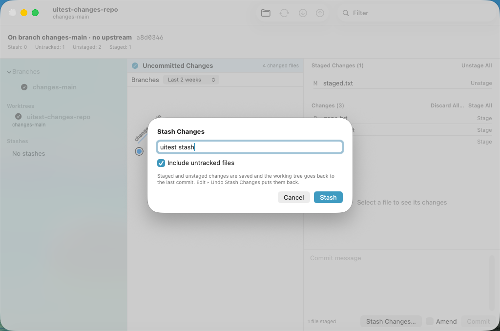
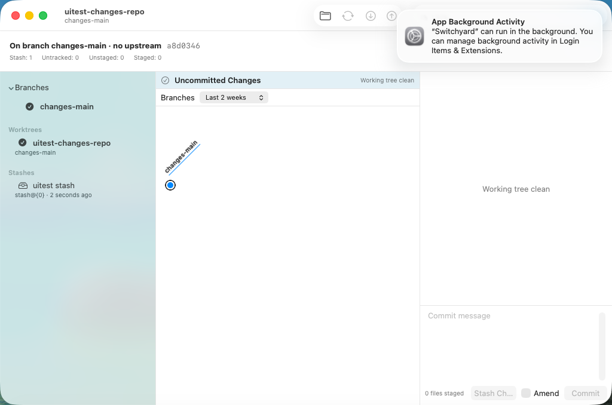
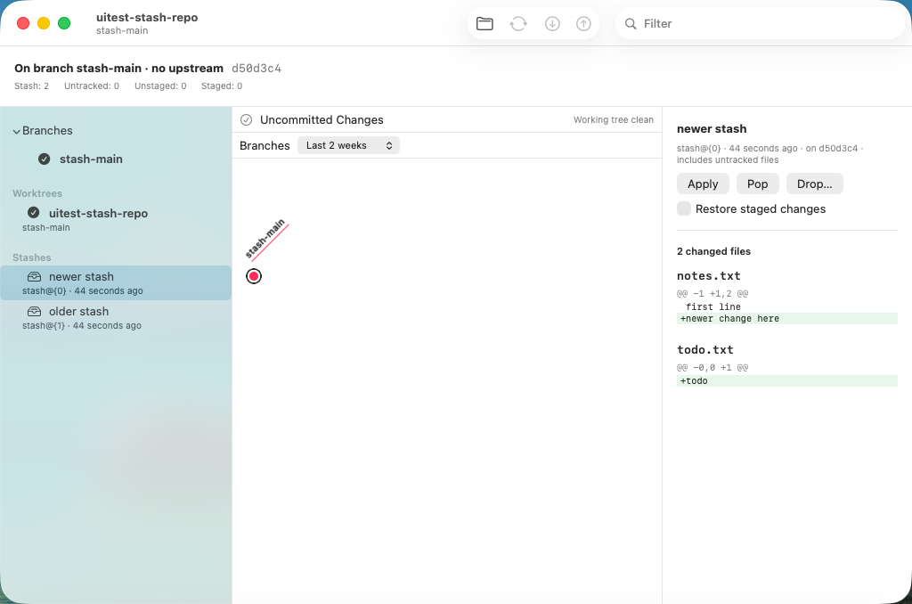
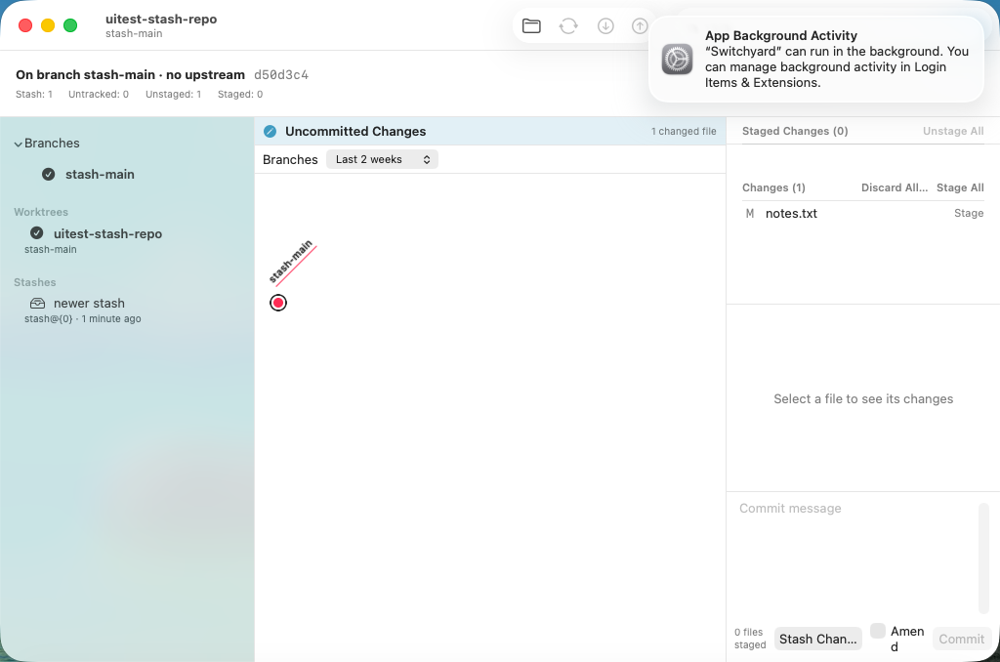

# 0489 — Stashes: list, show, Stash Changes…, Apply, Pop and Drop…, each undoable (umbrella)

| | |
|---|---|
| **Status** | resolved |
| **Module** | YardGit, YardUI |
| **Milestone** | — |
| **Platform** | macOS |
| **First seen** | 2026-09-29 |
| **Children** | #0490, #0491, #0492, #0493, #0494, #0495, #0496 |
| **Related** | #0437 (Changes view), #0394 (conflict hand-off), #0467 (Discard, the same journal contract), #0359 (destructive-dialog rule) |

## Description

The sidebar shows only a stash count ("2 stashes"), and nothing in the app can make, apply or drop
a stash. **Guide §11 decision 36** is the design. In short:

- **Stash Changes…** in the Changes view opens a sheet with an optional message and **Include
  untracked files** (on). One journal entry; Edit ▸ **Undo Stash Changes** puts the changes back and
  removes the stash.
- The sidebar's **Stashes** section lists every stash. Clicking one shows it in the Detail pane: its
  message, base commit and files, with **Apply**, **Pop**, **Drop…** and a **Restore staged
  changes** checkbox (`--index`). The row's context menu has the same three. Drop… asks first.
- **Pop is `git stash pop`, one entry.** A conflicting apply or pop is an outcome, not an error: git
  applies what it can, keeps the stash and starts no operation; the app says so, and the header's
  existing **Resolve Conflicts…** (#0394) takes over. Undo Apply / Undo Pop put everything back.
- **The journal captures the stash list itself** (`StashSnapshot`, #0490). A stash is a reflog
  entry, not a ref, and `RefSnapshot` records only `refs/stash`'s oid. Measured: restoring refs
  after `git stash drop stash@{1}` brings nothing back, and after dropping the top it brings the oid
  back with an empty message. The new piece rebuilds the reflog when the list differs, and every
  stash oid is a keep-alive parent, so **Undo Drop Stash** returns the entry with its message.

## Children, in dispatch order

| # | deliverable | files |
|---|---|---|
| #0490 | Engine: `StashSnapshot`, captured by every checkpoint and restored by every undo | `YardGit/StashSnapshot.swift` (new), `JournalAnchor.swift`, `JournalCheckpoint.swift`, `JournalRestore.swift`, `Tests/YardGitTests/StashSnapshotTests.swift` (new), the two coverage registries |
| #0491 | Engine: `Stash.list`, `Stash.push`, `Stash.Refusal` | `YardGit/Stash.swift` (new), `Tests/YardGitTests/StashPushTests.swift` (new), the two registries |
| #0494 | Changes view: Stash Changes… sheet, Undo titles, VM spike | `YardUI/WorkingChanges.swift`, `YardUI/JournalMenu.swift`, `YardUI/StashChangesSheet.swift` (new), `YardUI/WorkingChangesView.swift`, `Tests/YardUITests/StashChangesTests.swift` (new), `SwitchyardUITests/0494StashChangesUITests.swift` (new), `scripts/run-ui-tests-vm.sh` |
| #0492 | Engine: `Stash.apply` / `pop` / `drop`, `Stash.Outcome` | `YardGit/Stash.swift` (two insertions), `Tests/YardGitTests/StashApplyTests.swift` (new) |
| #0493 | Engine: `stashDiff` | `YardGit/Hunks.swift` (one insertion), `Tests/YardGitTests/StashDiffTests.swift` (new) |
| #0495 | YardUI data layer: `stashes` in the sidebar summary, `StashAction`, `StashDropConfirmation`, `StashRowText`, the loaders | `YardUI/RepositoryLoader.swift`, `YardUI/StashActions.swift` (new), `Tests/YardUITests/StashActionsTests.swift` (new) |
| #0496 | Sidebar stash rows, `StashDetailView`, `ContentView` wiring, VM stash fixture and spike | `YardUI/RepositorySidebarView.swift`, `YardUI/StashDetailView.swift` (new), `YardUI/ContentView.swift`, `Tests/YardUITests/RerereSurfaceTests.swift`, `scripts/uitest-fixtures/make-stash-fixture.sh` (new), `scripts/run-ui-tests-vm.sh`, `SwitchyardUITests/UITestSupport.swift`, `SwitchyardUITests/0496StashListUITests.swift` (new) |

**Order.** Strictly serial, in the table's order: **#0490 → #0491 → #0494 → #0492 → #0493 → #0495 →
#0496**. #0494 is pulled forward because it is the first thing anyone can see and needs only #0490
and #0491 (the priority section's rule 5). The children's numbers are not their order. Each edit
anchors on text the previous children leave: the registry rows chain #0490 → #0491, `Stash.swift`
#0491 → #0492, the `run_spike_if_selected` lines #0494 → #0496. No child edits a file #0488 touched
except that #0496 *uses* `FileDiffView(file:)`, whose initializer #0488 left unchanged.

**Staged check.** Every child's edits are held in one script (`ops.py` in the planning scratch
directory) that both renders the issue text and applies it. Applied in order to a fresh `main`
(86c47dab) checkout, the result was byte-identical to the prototype, and each child's filtered tests
passed after its own step (see the work log).

## Expected behavior

- [ ] #0490–#0496 resolved and merged.
- [ ] On `main`, `./scripts/run-ui-tests-vm.sh 0494` and `./scripts/run-ui-tests-vm.sh 0496` pass.

## Questions for Brennan (the plan assumed an answer to each; none blocks a child)

1. **Undo restores the stash list repository-wide.** `refs/stash` lives in the common directory, so
   an Undo in one worktree puts the whole list back as its entry recorded it, which also removes a
   stash a sibling worktree (or a terminal `git stash`) made since. Redo brings it back. Assumed:
   keep the journal's whole-snapshot contract (decision 34 made the same call for the worktree).
   The alternative is a stash restore that only re-adds entries and never removes one it did not
   record — which would break Undo Stash Changes, whose whole point is removing the new stash.
2. **Include untracked files defaults to on**, where git's own default is off. Assumed: on, because
   the Changes list shows untracked files and Stash Changes should empty it. Easy to flip.
3. **Apply and Pop bring staged changes back unstaged by default** (git's default), with a Restore
   staged changes checkbox for `--index`. The checkbox lives in the Detail pane only; the sidebar
   context menu always uses git's default. Assumed fine; the alternative is `--index` by default,
   which fails outright ("conflicts in index") whenever the staged half no longer applies.
4. **A conflicting Apply/Pop has no Abort.** git starts no operation, so the header shows Resolve
   Conflicts… but no Continue or Abort; the way back is Edit ▸ Undo Pop Stash. Assumed acceptable;
   an explicit "Abort" there would be Undo under another name.
5. **Out of scope:** `git stash branch`, stashing selected files or hunks (`push -- <paths>`,
   `--staged`, `--patch`), `--keep-index`, renaming a stash, and `switchyard stash …` CLI verbs.
   Which, if any, belong in the MVP?
6. **Reflog dates are rewritten by an Undo** that rebuilds the list (the entries get the restore's
   timestamp). Nothing in the app shows reflog dates — rows are dated by the stash commit — but
   `git stash list --date=relative` in a terminal would. Assumed acceptable.

## Work log

- 2026-09-29 planned (Opus): guide §11 decision 36 committed. Every child prototyped in the planning
  worktree `../sy-plan-stash` (detached, never pushed) on `main` 86c47dab.
- 2026-09-29 full suite on the whole prototype: `Test run with` 162 / **397** / 399 / **1167** / 14 /
  122, against 162 / 385 / 399 / 1138 / 14 / 122 on `main` measured the same day. That is +12 in the
  `YardUITests` bundle (#0494 4, #0495 8) and +29 in the `YardGitTests` bundle (#0490 9, #0491 8,
  #0492 9, #0493 3); nothing else moved.
- 2026-09-29 planning VM runs (after checking `tart list` each time; no foreign clone was running):
  **`spike-0494` and `spike-0496` `TEST SUCCEEDED`**, and each failed as it should under a negative
  control (#0494: the sheet's Stash does nothing; #0496: Drop does nothing). The first `spike-0496`
  screenshot showed the Restore staged changes checkbox wrapping a word per line beside the buttons,
  and the popped-changes screenshot showed Stash Changes… truncating the Amend row; both were moved
  to their own rows in the children's code, and `spike-0494` and `spike-0496` passed again after
  the move.
- 2026-09-29 staged check, final: `ops.py` applied #0490–#0496 in order to a fresh `main` (86c47dab)
  checkout (`../sy-plan-stash-c`); the tree was byte-identical to the prototype. Filtered runs after
  each step: #0490 `StashSnapshotTests` 9 and the registries 9 in 2 suites; #0491 `StashPushTests`
  8; #0492 `StashApplyTests` 9; #0493 `StashDiffTests` 3; #0494 37 in 3 suites (`StashChangesTests`,
  `JournalMenuTests`, `WorkingChangesTests`); #0495 16 (`StashActionsTests` and the sidebar tests);
  #0496 `RerereSurfaceTests` 10 — all passing. Full suite on the staged tree: 162 / 397 / 399 / 1167
  / 14 / 122, all passing.

- 2026-09-29 umbrella review: children #0490-#0496 all resolved; the stash is visible end to end in the VM (Stash Changes… sheet #0494, sidebar list + detail #0496), and every stash mutation is one journal entry that Edit ▸ Undo reverts. Open questions above stand with their assumed defaults.
