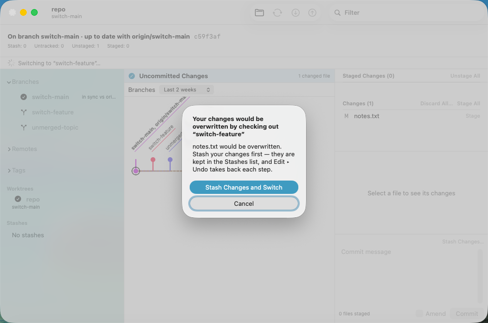
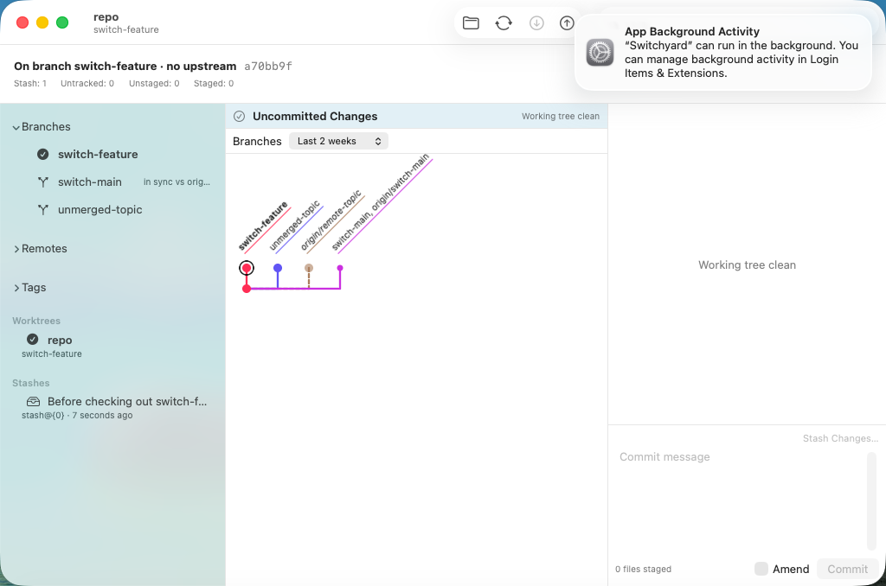
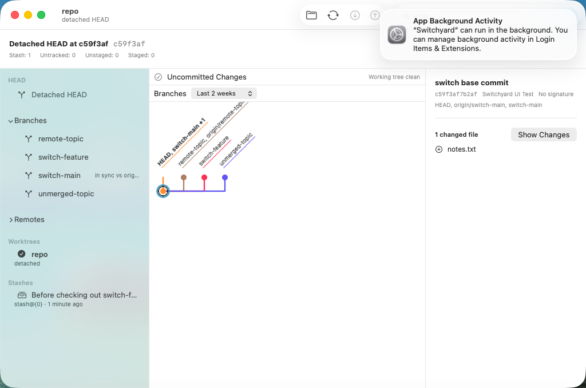

# 0506 — Switch branches, check out a remote branch or a commit, delete a branch or a tag, each undoable (umbrella)

| | |
|---|---|
| **Status** | open |
| **Module** | YardGit, YardUI |
| **Milestone** | — |
| **Platform** | macOS |
| **First seen** | 2026-09-29 |
| **Children** | #0507, #0508, #0509, #0510, #0511, #0512 |
| **Related** | #0363 (branch and tag management engine), #0359 (commit action menu, destructive-dialog rule), #0489 (stashes — Stash Changes and Switch reuses `Stash.push`), #0231 / guide decision 20 |

## Description

The app cannot change what is checked out. It has Create Branch…, Edit Local Branch… (rename), Add
Tag…, Set Branch Tip Here…, merge and rebase, and a sidebar of branches, remotes and tags — but no
way to **switch** to a branch, check out a **remote branch** as a local one, **detach** at a commit,
**delete a branch** or **delete a tag**. `YardGit` has `Branch.delete` (#0363, with the checked-out,
held-by-worktree and unmerged refusals) and nothing that moves `HEAD`; the CLI has `branch delete`
and no `switch` or `tag delete`.

**Guide §11 decision 38** is the design. In short:

- **Sidebar.** Double-click a local branch to switch; its context menu has **Switch to “x”** and
  **Delete Branch…**. A remote branch row: **Check Out as Local Branch**. A tag row: **Delete Tag…**.
- **Commit menu** (and the History row's context menu): **Check Out (Detached)**.
- **One journal entry each**, so Edit ▸ Undo reverts it (Undo Switch Branch, Undo Check Out Branch,
  Undo Check Out Commit, Undo Delete Branch, Undo Delete Tag).
- **Local changes follow `git switch`**: carried when the file is the same on both sides; a change
  the checkout would overwrite refuses it, decided before the checkpoint by git's own two-way merge
  as a dry run. The app then offers **Stash Changes and Switch** (two entries: stash, then switch).
- **Delete Branch… always asks**, and an unmerged branch asks a second time before it is forced.

## Children, in dispatch order

| # | deliverable | files |
|---|---|---|
| #0507 | Engine: `Checkout` — switch, check out as local branch, detach; the dry-run refusal | `YardGit/Checkout.swift` (new), `Tests/YardGitTests/CheckoutTests.swift` (new), the two coverage registries |
| #0508 | Engine: `Tag.delete` and `RefManageError.unknownTag` | `YardGit/RefManage.swift`, `Tests/YardGitTests/TagDeleteTests.swift` (new) |
| #0509 | YardUI data layer: `RefAction`, `RefActionContext`, `RefActionRules`, `RefDeleteConfirmation`, `CheckoutBlocked`, `performRefAction`, the Undo titles | `YardUI/RefActions.swift` (new), `YardUI/JournalMenu.swift`, `Tests/YardUITests/RefActionsTests.swift` (new) |
| #0510 | Sidebar context menus and double-click, `RefActionDialogs`, `ContentView.runRefAction` | `YardUI/RepositorySidebarView.swift`, `YardUI/RefActionDialogs.swift` (new), `YardUI/ContentView.swift` |
| #0511 | Commit menu: Check Out (Detached) | `YardUI/CommitActions.swift`, `YardUI/ContentView.swift` (one case), `Tests/YardUITests/CommitActionMenuTests.swift` |
| #0512 | VM fixture and spike | `scripts/uitest-fixtures/make-switch-fixture.sh` (new), `scripts/run-ui-tests-vm.sh`, `SwitchyardUITests/UITestSupport.swift`, `SwitchyardUITests/0512SwitchBranchUITests.swift` (new) |

**Order.** #0507 and #0508 are independent (different files) and may run in parallel. Then strictly
serial: **#0509 → #0510 → #0511 → #0512**. #0509 needs both engine children (`Checkout`,
`Tag.delete`, `RefManageError.unknownTag`); #0510 needs #0509's types; #0511 calls #0510's
`runRefAction`; #0512's spike drives all of it. No child edits a file #0505 (in flight: skill prose
and README) touches.

**Staged check.** Every child's edits are held in one script (`ops.py` in the planning scratch
directory) that both renders each issue's "The files" section and applies it. Applied in order to a
fresh `main` (8384cfa7) export, the result was byte-identical to the prototype.

## Expected behavior

- [ ] #0507–#0512 resolved and merged.
- [ ] On `main`, `./scripts/run-ui-tests-vm.sh 0512` passes.

## Questions for Brennan (the plan assumed an answer to each; none blocks a child)

1. **A checkout that would overwrite local changes offers one button, Stash Changes and Switch**
   (stash with untracked files, then switch — two Undo steps), and Cancel. Assumed: this. The
   alternatives are opening the Stash Changes… sheet (the user then has to click Switch again), or
   adding a "Discard Changes and Switch" (destructive; Undo would restore it, but it is one click
   from losing work). Also assumed: Return triggers Stash Changes and Switch — it is not
   destructive and both steps undo.
2. **An unmerged branch asks twice, with no typed confirmation.** Delete Branch… → Delete Branch;
   the engine refuses an unmerged branch; a second dialog → Delete Unmerged Branch forces it. Undo
   Delete Branch restores it either way. Assumed sufficient; the alternative is typing the branch
   name.
3. **Undo of Check Out as Local Branch leaves the new local branch** (decision 20: a restore deletes
   only refs its snapshot recorded — Undo New Branch already behaves this way). `HEAD`, the index
   and the working tree do go back. Assumed acceptable. Changing it means letting a restore delete
   refs its own operation created, which reopens #0231.
4. **The local name is fixed**: `origin/x` → `x`, and the item is disabled ("A local branch “x”
   already exists") when `x` exists. No name prompt. Assumed fine for the MVP.
5. **Double-click switches on local branch rows only.** A remote row's double-click does nothing
   (its menu has Check Out as Local Branch). Should a double-click on a remote row check it out?
6. **No CLI verbs in this plan.** `switch` would be a thin arm like decision 37's; `tag delete` has a
   grammar question — `tag <name> <commit>` already takes a positional name, so `tag delete v1`
   is ambiguous with a tag named `delete`. Assumed: a later issue, once the grammar is chosen
   (`tag --delete <name>` is git's own spelling).
7. **Out of scope:** deleting a remote branch (a push), renaming a tag, choosing the new branch's
   name, switching by double-clicking a branch chip in the History pane.

Cosmetic, seen in the planning VM run and not filed: the header's "Switching to …" progress line
stays visible behind the dirty-tree alert until the refresh finishes.

## Work log

- 2026-09-29 planned (Opus): guide §11 decision 38 committed; children written from a
  prototype in the planning worktree `../sy-plan-switch` (detached, never pushed) on `main` 8384cfa7.
- 2026-09-29 full suite on the whole prototype: `Test run with` 162 / **407** / 399 / **1181** / 14 /
  171, all passing — +10 in the `YardUITests` bundle (#0509 9, #0511 1) and +14 in the
  `YardGitTests` bundle (#0507 12, #0508 2); nothing else moved.
- 2026-09-29 planning VM runs (`tart list` checked first; no foreign clone): **`spike-0512` `TEST
  SUCCEEDED`** on the first run (20260929-181011-85484). Negative control — the alert's Stash
  Changes and Switch not calling `onConfirm`, overlaid — `RESULT: TEST FAILED (exit 65)` with "Stash
  Changes and Switch did not switch".
- 2026-09-29 mutations: every child's listed mutations were applied and reverted in the planning
  worktree and observed red (see each child). Staged check: byte-identical (above).

