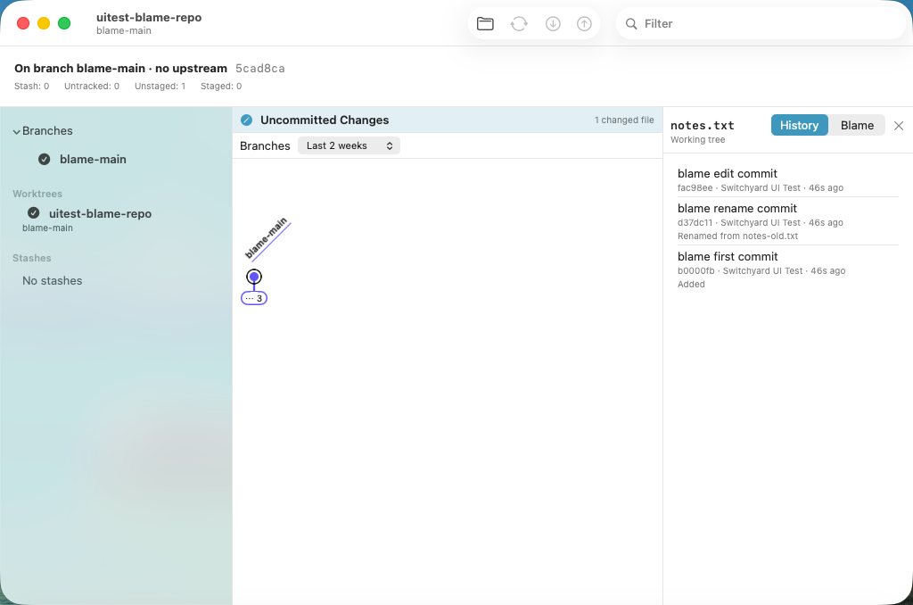
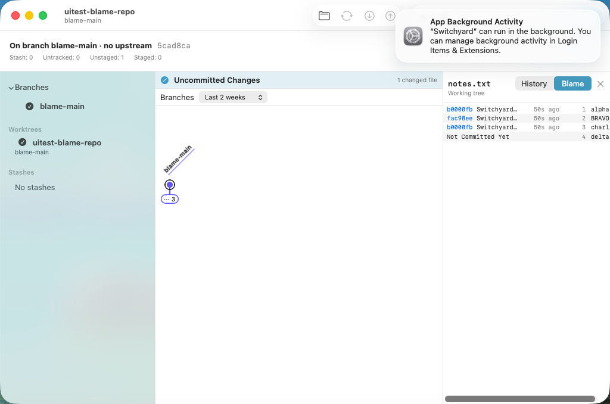
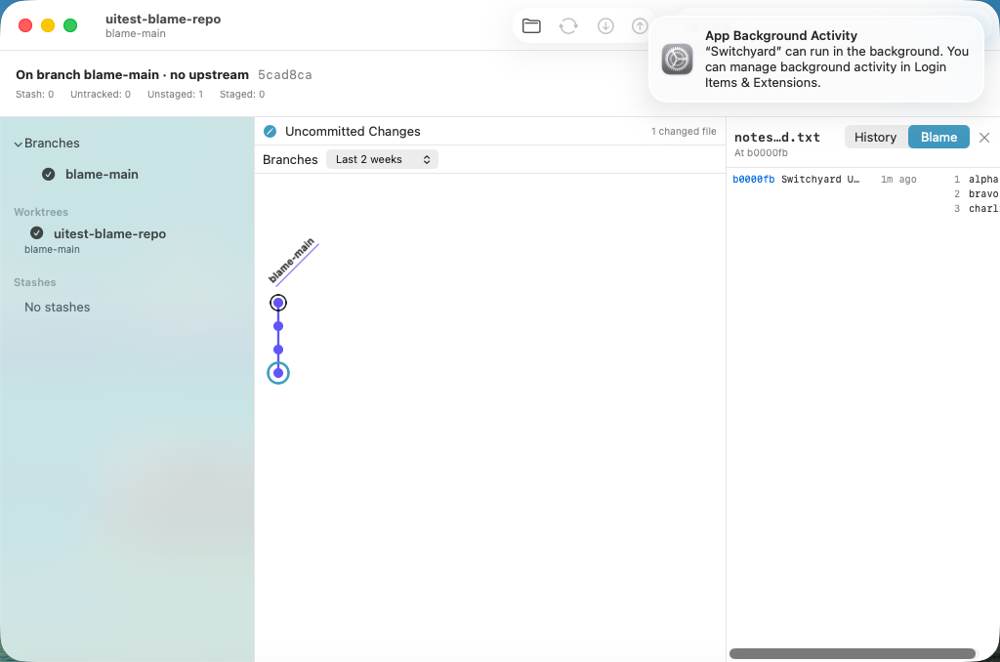

# 0513 — File history and blame: Show History and Blame for a file, in the Detail pane (umbrella)

| | |
|---|---|
| **Status** | open |
| **Module** | YardGit, YardUI, UI tests |
| **Milestone** | — |
| **Platform** | macOS |
| **First seen** | 2026-09-29 |
| **Children** | #0514, #0515, #0516, #0517, #0518, #0519, #0520 |
| **Related** | #0018 (`blameFile`), #0406 (the commit changes window), #0401 (`HistoryScrollRequest`), #0405 (History's 5,000-commit load), guide §11 decisions 30 and 36 |

## Description

The engine has `blameFile` (#0018, `YardKit/Sources/YardGit/Blame.swift`) and nothing uses it but
`absorb`. The app has **no blame view and no per-file history**: from a file in the Changes view, a
commit's changed files, or anywhere in the working tree there is no way to ask "who wrote this line"
or "what changed this file".

**Guide §11 decision 39** is the design. In short:

- **One read-only inspector in the Detail pane, over the selection.** Header: the path, "Working
  tree" or "At 1234567", a **History | Blame** segmented control, a close button. Closing it shows
  the selection underneath again; any selection the user makes closes it.
- **Entry points:** Show History / Blame on a Changes-view row's context menu (not untracked or
  conflicted; Blame disabled on a deleted row), on each of a commit's changed files in the Detail
  pane (at that commit), and File ▸ Show File History… / Blame File… (an open panel in the worktree).
  A History row's menu has Blame This Version.
- **History is `git log --follow <rev> -- <path>`**, measured on git/git to keep every non-merge
  commit and add the ones before a rename; merges are not listed; a staged rename follows from its
  original path.
- **Blame** groups lines into runs by commit; the gutter (short oid link, author, relative date) is
  on a run's first line. **Clicking a commit** (a blame link or a History row) selects it in the
  History pane and scrolls to it, **with the inspector still open**; a commit older than History's
  5,000 opens its changes window instead.
- **Off the main actor and cancellable** (`@concurrent` loaders; an async `blameFile` whose
  cancellation terminates `git`), and **lazy** (`LazyVStack`). No journal entry.

## Children, in dispatch order

| # | deliverable | files |
|---|---|---|
| #0514 | Engine: `FileHistory.run` (`git log --follow`), `FileHistory.Entry`, `.Failure` | `YardGit/FileHistory.swift` (new), `Tests/YardGitTests/FileHistoryTests.swift` (new), the two coverage registries |
| #0515 | Engine: the async `blameFile` twin | `YardGit/Blame.swift`, `Tests/YardGitTests/BlameAsyncTests.swift` (new) |
| #0516 | YardUI data layer: `FileInspectorTarget`, `FileInspectorLink`, `BlameRow(s)`, `FileHistoryRowText`, `loadFileHistory`, `loadBlameRows` | `YardUI/FileInspector.swift` (new), `Tests/YardUITests/FileInspectorTests.swift` (new) |
| #0517 | `FileInspectorView`; `ContentView`'s state, Detail-pane branch, `openFromInspector`, the selections that close it | `YardUI/FileInspectorView.swift` (new), `YardUI/ContentView.swift` |
| #0518 | Context menus: Changes-view rows, a commit's changed files | `YardUI/WorkingChangesView.swift`, `YardUI/CommitDetailView.swift`, `YardUI/ContentView.swift` (two call sites) |
| #0519 | File ▸ Show File History… / Blame File… | `YardUI/FileInspectorMenu.swift` (new), `Tests/YardUITests/FileInspectorMenuTests.swift` (new), `YardUI/ContentView.swift` (one line), `Switchyard/SwitchyardApp.swift` (one line) |
| #0520 | VM fixture and spike | `scripts/uitest-fixtures/make-blame-fixture.sh` (new), `scripts/run-ui-tests-vm.sh`, `SwitchyardUITests/UITestSupport.swift`, `SwitchyardUITests/0520FileHistoryBlameUITests.swift` (new) |

**Order and parallelism.** **#0514 ∥ #0515** (different files; only #0514 touches the registries).
Then **#0516** (needs both) → **#0517**. Then **#0518 ∥ #0519** may run together: both edit
`ContentView.swift`, but in different hunks (#0518 the two Detail-pane call sites, #0519 one line
beside `.focusedSceneValue(\.journalMenuTarget, …)`), and the rest of their files are disjoint —
merge `main` into the second before reviewing it. **#0520** needs #0518 merged, and **#0512 merged**:
its script and `UITestSupport` edits are anchored on #0512's lines (the prototype applied #0512's
round commit d4167096 for that reason). #0519 is not driven by the spike (an open panel; question 5).

**Staged check.** Every child's edits are held in one script (`ops.py` in the planning scratch
directory) that both renders each issue's "The files" section and applies it. Applied in order to a
fresh export of `main` 26b3e511 plus #0512's d4167096, the result was **byte-identical** to the
prototype for all 21 touched files. #0514–#0517 alone, applied to a fresh `main` export, built with
`--build-tests` and passed `FileInspectorTests|FileHistoryTests|BlameAsyncTests` (10 + 9).

## Expected behavior

- [ ] #0514–#0520 resolved and merged.
- [ ] On `main`, `./scripts/run-ui-tests-vm.sh 0520` passes.

## Questions for Brennan (the plan assumed an answer to each; none blocks a child)

1. **Where it appears: the Detail pane, over the selection.** Assumed: this (decision 39's reasoning:
   the click-a-commit interaction needs History visible beside it; a sheet is modal, a window would
   need routing back to its repository window). The alternative is a window per file like the
   commit changes window (#0406) — wider, several open at once, but a commit click would bring the
   main window forward over it.
2. **History lists no merges** — `--follow`'s own behaviour (git/git `builtin/log.c`: 609 with
   `--follow`, 0 merges; 636 without, 205 of them merges). Assumed right: each merged branch's own
   commits are listed. Showing merges that touched the file would mean a second walk without
   `--follow`.
3. **A commit older than History's 5,000 opens its changes window** rather than being selected.
   Assumed acceptable (on git/git most blame lines are that old). The alternative is loading that
   one commit into the Detail pane on demand — a new path through `ContentView`'s selection model.
4. **No CLI verbs in this plan.** `switchyard log` refuses every `-`-prefixed token (#0346), so
   `log -- <path>` does not work today; there is no `blame`. Both would be thin arms over
   `FileHistory.run` and `blameFile` (`BlameLine` is already `Encodable`; `FileHistory.Entry` is
   not). Assumed: a later issue, with the grammar chosen (`log --follow <path>`? `blame <path>
   [--at <rev>]`?).
5. **File ▸ Show File History… is not covered by the VM spike** (a modal `NSOpenPanel` in the guest
   is its own spike). Its path logic is unit-tested (#0519). Assumed acceptable for now.
6. **The unstaged row of a renamed file** has no `originalPath` (only staged rows carry it,
   `WorkingChanges.init`), so its Show History starts from the new path and is empty; the staged
   row's follows the rename. Assumed acceptable; fixing it means threading the rename into unstaged
   rows.
7. **Out of scope:** Show History / Blame in the commit changes window (#0406 — a different window,
   the routing question of 1), blame options (`-w`, `-M`/`-C`; `blame.ignoreRevsFile` is honoured by
   git itself), keyboard shortcuts for the two items, and folders (`--follow` takes one file).

## Work log

- 2026-09-29 planned (Opus): guide §11 decision 39 committed; children written from a prototype in
  the planning worktree `../sy-plan-blame` (detached, never pushed) on `main` 26b3e511 with #0512's
  round commit d4167096 applied.
- 2026-09-29 full suite on the whole prototype: `Test run with` 162 / **420** / 399 / **1190** / 14 /
  171 — +13 in the `YardUITests` bundle (#0516 10, #0519 3) and +9 in the `YardGitTests` bundle
  (#0514 6, #0515 3); nothing else moved. (The first run failed
  `noSourceConcatenatesOntoDotGit` on #0519's first draft, which compared a `".git/"` prefix; the
  file now compares the first path component, and #0519 records the trap.)
- 2026-09-29 mutations: every child's listed mutations were applied and reverted in the planning
  worktree and observed red (see each child). Staged check: byte-identical (above).
- 2026-09-29 performance, git/git on the host (debug build): `builtin/log.c` (2,820 lines) history
  609 entries in 0.59–1.14 s, blame 0.29–0.35 s (rows 8–11 ms of it); `blame.c` (2,957 lines)
  0.10–0.12 s; `diff.c` (7,881 lines) 0.59–0.61 s, history 1,194 entries 0.65–0.71 s.
- 2026-09-29 planning VM runs (`tart list` checked first; waited, bounded, for another session's
  run): **`spike-0520` `TEST SUCCEEDED`** on the third run (20260929-204657-79602). The first two
  found real defects, now fixed in the children: the history rows' combined accessibility element
  hid "Renamed from …", the blame floated to the pane's middle with its text off-screen, the `.link`
  buttons were not `window.buttons` (#0520), and **closing the inspector crashed the app** through
  `Binding($fileInspector)`'s force unwrap (#0517). Negative control — `openFromInspector` also
  closing the inspector — `TEST FAILED (exit 65)`, "clicking a commit closed the inspector".
- 2026-09-29 full suite on the final prototype, re-run after those fixes: 162 / 420 / 399 / 1190 /
  14 / 171, all passing. Staged check re-run: byte-identical, 21 files.

- 2026-09-29 planned (Opus, 4710 s, 319,023 tokens): decision 39; #0514 ∥ #0515 → #0516 → #0517 → (#0518 ∥ #0519) → #0520.
