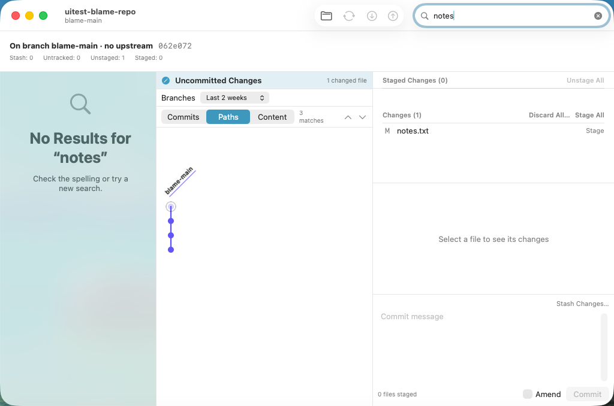
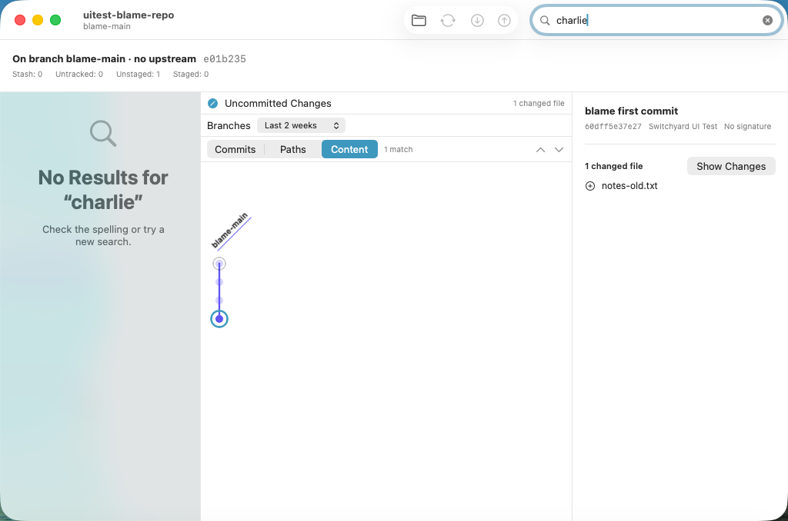

# 0521 — History search: find commits by author, by changed path, and by added or removed text (umbrella)

| | |
|---|---|
| **Status** | resolved |
| **Module** | YardGit, YardUI, UI tests |
| **Milestone** | — |
| **Platform** | macOS |
| **First seen** | 2026-09-29 |
| **Children** | #0522, #0523, #0524, #0525 |
| **Related** | #0402 (the filter's match bar), #0378 (the sidebar filter), #0405 (History's 5,000-commit load), #0520 (the blame fixture the spike reuses), guide §11 decisions 29 and 39 |

## Description

The History filter (#0402) finds a commit by its message, a ref name on it, or an oid prefix. It
cannot find one **by who wrote it**, **by which files it changed**, or **by what text it added or
removed** — the questions a daily user (Brennan, coming from GitUp, whose search covers them) asks
of history most: "when did `Sources/Engine/` change", "who added this string", "what did Ada commit
last week". File history (decision 39) is one file at a time, `--follow`, never a folder or a
pattern.

**Guide §11 decision 40** is the design, and records why this was chosen over remote management and
diff whitespace options. In short:

- **Author** joins the in-memory Commits match (`HistoryFilter`), case- and diacritic-insensitive.
- **The match bar gains a Commits | Paths | Content segmented control.** Commits is today's match
  plus author. **Paths**: a commit changed a file whose path contains the text
  (`git log -- ':(icase)*text*'`, glob characters escaped). **Content**: a commit added or removed
  the text (`git log -M -i -S<text>`). Both `--no-merges`.
- **Only History's loaded commits are searched** — passed on stdin to `git log --no-walk=unsorted
  --stdin`, so the cost is the window's: on git/git, 0.28 s (path) and 0.41 s (content) over the
  5,000 loaded, against 2.0 s and 7.8 s walking all 85,179.
- **Debounced, off the main actor, cancellable**: a `.task(id:)` with a 250 ms settle; the count
  reads "Searching…" while git runs; matches dim and ⌘G / ⇧⌘G step exactly as #0402's do.
- Read-only. No CLI verb.

## Children, in dispatch order

| # | deliverable | files |
|---|---|---|
| #0522 | Engine: `HistorySearch.run(kind:query:candidates:at:git:)` — path and content search over given commits | `YardKit/Sources/YardGit/HistorySearch.swift` (new), `YardKit/Tests/YardGitTests/HistorySearchTests.swift` (new) |
| #0523 | The Commits scope matches the author | `YardKit/Sources/YardUI/HistoryFilter.swift`, `YardKit/Tests/YardUITests/HistoryFilterTests.swift` |
| #0524 | The match bar's scope control, and the git-backed search in the History pane | `YardKit/Sources/YardUI/HistorySearchScope.swift` (new), `YardKit/Tests/YardUITests/HistorySearchScopeTests.swift` (new), `YardKit/Sources/YardUI/CommitHistoryView.swift` |
| #0525 | VM spike: Paths and Content on the blame fixture | `SwitchyardUITests/0525HistorySearchUITests.swift` (new), `scripts/run-ui-tests-vm.sh` |

**Order and parallelism.** **#0522 ∥ #0523** (disjoint files, different targets). **#0524** needs
#0522 merged (it calls `HistorySearch`); it does not touch #0523's files, so it may start once #0522
is in. **#0525** needs #0524 merged **and #0520 merged** — it reuses #0520's blame fixture,
`UITestBlameFixture` and `launchWithBlameFixture()`, and its `run-ui-tests-vm.sh` line is anchored
after #0520's.

## Expected behavior

- [ ] #0522–#0525 resolved and merged.
- [ ] On `main`, `./scripts/run-ui-tests-vm.sh 0525` passes, and `./scripts/run-ui-tests-vm.sh 0402`
      (the match bar this changes) still does.

## Questions for Brennan (the plan assumed an answer to each; none blocks a child)

1. **Scopes in the match bar, not a query syntax or a union.** Assumed: a Commits | Paths | Content
   segmented control that appears with the match bar. The alternatives are prefixes typed in the
   field (`author:ada path:Sources/`) — more powerful, nothing teaches them — or searching all three
   at once, which makes the count meaningless ("filter" matches every commit touching a file named
   for it *and* every message saying it).
2. **Only loaded commits are searched** (History's newest 5,000). Assumed right: a match beyond the
   window could not be shown or selected anyway, and the bound keeps a content search under half a
   second on git/git. Searching everything would need History to page in the matches it found.
3. **The scope resets to Commits per window, and the sidebar keeps narrowing refs by the text in
   every scope** (#0378). Assumed acceptable; typing a path in Paths will empty the sidebar's branch
   list while it is in the field. Scoping the sidebar filter to Commits only is a one-line follow-up
   in `ContentView` if it grates.
4. **Content is `-S` (occurrence count changed), not `-G` (a changed line matches a regex).** `-S`
   answers "which commit added or removed this"; a commit that only moves a line containing the text
   does not match. Assumed right for a literal search box; `-G` is the choice if it should be "any
   changed line mentioning it".
5. **Matches on a lane the recency filter hides** (decision 29) dim and count but cannot be seen,
   exactly as #0402's already behave; ⌘G to one selects it (the Detail pane shows it) without the
   map scrolling there. Not changed here; setting the recency pop-up to All branches shows them.
6. **Out of scope:** a CLI verb (`switchyard log` refuses `-`-prefixed tokens, decision 39), date
   ranges, regex search, searching the working tree, and remembering the scope across windows.

## Work log

- 2026-09-29 planned (Opus): guide §11 decision 40 committed; children written from a prototype in
  the planning worktree `../sy-plan-next` (detached, never pushed) on `main` db27f205.
- 2026-09-29 staged check: #0522–#0524's "The files" sections, applied by script to a fresh
  `git archive` of `main` db27f205, are **byte-identical** to the prototype for all 7 touched files.
- 2026-09-29 full suite on the prototype (#0522–#0524 applied): `Test run with` 162 / **424** /
  399 / **1199** / 14 / 171, all passing — +4 in the `YardUITests` bundle (#0523 1, #0524 3) and +9
  in the `YardGitTests` bundle (#0522) against the 162 / 420 / 399 / 1190 / 14 / 171 #0513 recorded.
- 2026-09-29 mutations: every mutation listed in #0522, #0523 and #0524's tables was applied alone
  and observed red, then reverted (#0522's re-run against the final `-M -i -S` arguments).
- 2026-09-29 planning VM run (`tart list` checked, then a bounded wait for another session's full
  suite): **`spike-0525` `RESULT: TEST SUCCEEDED`** (run 20260929-233353-11759), on the prototype
  with #0520's edits applied from its issue text. Its Paths screenshot showed the count wrapping to
  "3 / matches" beside the segmented control; #0524 (d) now gives the count `.lineLimit(1)` and
  `.fixedSize()` (staged check re-run: identical). The screenshots also show question 3 in practice:
  the sidebar reads "No Results for “notes”".
- 2026-09-29 planning VM re-run with the count fix: **`spike-0525` `RESULT: TEST SUCCEEDED`** (run
  20260929-233713-13050); "3 matches" on one line. The screenshots below are from this run. After
  the runs `tart list` shows no leftover clone, and `~/Library/Logs/DiagnosticReports` has no new
  Switchyard or XCTest report.

- 2026-09-30 umbrella review: #0522-#0525 all resolved. Visible end to end in the VM: "notes" is 0 matches under Commits and 3 under Paths; "charlie" under Content is 1, and ⌘G selects the matching commit. Author now matches under Commits. Questions 1-6 stand with their assumed defaults.
