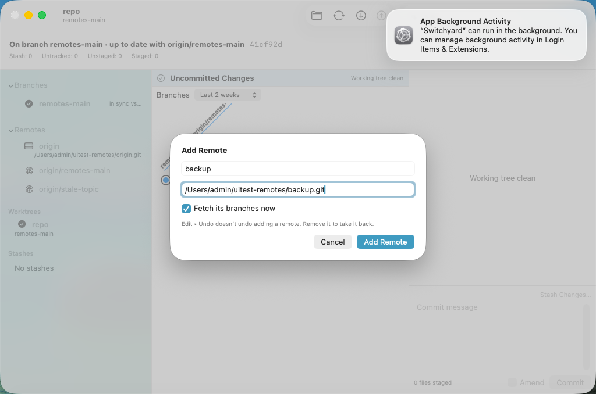
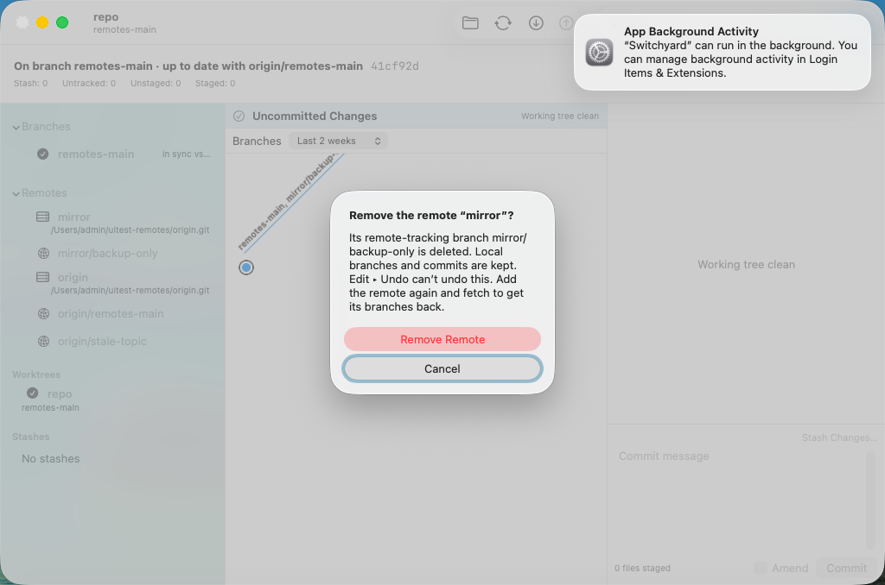
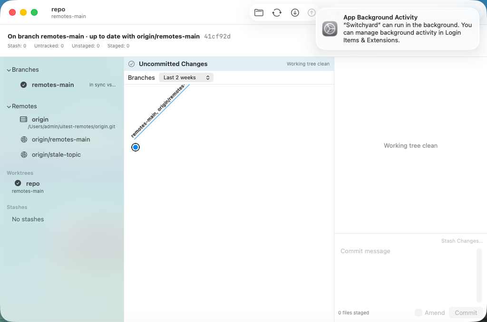

# 0526 — Remote management: list remotes with their URLs; Add, Edit URL, Rename, Remove; Fetch and Prune one remote (umbrella)

| | |
|---|---|
| **Status** | open |
| **Module** | YardGit, YardUI |
| **Milestone** | — |
| **Platform** | macOS |
| **First seen** | 2026-09-30 |
| **Children** | #0527, #0528, #0529, #0530, #0531, #0532, #0533 |
| **Related** | guide §11 decisions 32 (Fetch/Pull/Push; the push entry Undo refuses, #0461), 38 (sidebar ref actions, #0506), 40 (named this the runner-up) |

## Description

The app cannot manage remotes. The sidebar's Remotes section lists remote-tracking branches, but
not the remotes themselves: nowhere shows where `origin` points, and there is no way to add a
second remote, fix a URL, rename or remove one, or fetch or prune just one. `YardGit` has
`RemoteSync.remoteNames` and the toolbar's all-remotes Fetch, and nothing else; the CLI has
`fetch`, `pull`, `push` and no remote verbs. Guide §11 decision 40 named this the runner-up.

**Guide §11 decision 41** is the design. In short:

- **Sidebar.** Each configured remote is a row (name, fetch URL; push URLs in the help when they
  differ) above its own remote-tracking branches. Its menu: **Fetch “x”**, **Prune “x”**, **Edit
  URL…**, **Rename Remote…**, **Remove Remote…**, **Add Remote…** (also on the Remotes header and a
  "No remotes" row, so it is always reachable).
- **Validation the way git does it**: a name is valid exactly when `git check-ref-format
  refs/remotes/<name>/test` accepts it (measured against `git remote add` on 47 names), plus no
  leading `-` and no name nesting with another (`a` beside `a/b`); a URL is non-empty, has no control
  characters and no leading `-` (git accepts an empty URL and a newline — measured).
- **Journal.** Add and Edit URL change only `git config`, which no journal entry captures: **not
  journaled**, and each sheet says Edit ▸ Undo doesn't undo it. Rename and Remove move refs *and*
  config: each writes an entry **after** it succeeds and **Undo refuses that entry** ("Can’t Undo
  Rename Remote" / "Can’t Undo Remove Remote") — measured, without the refusal an Undo after `git
  remote remove origin` recreated `refs/remotes/origin/main` for a remote that no longer existed.
  Fetch “x” and Prune “x” are journaled before they run and undo normally (Undo Fetch, Undo Prune).
- **Remove Remote… always asks** and names what goes: its remote-tracking branches (deleted) and
  the branches whose upstream it was (they stop tracking it — git unsets both `branch.<b>.remote`
  and `.merge`, measured). Local branches and commits stay.
- **No network in any test**: bare repositories and paths only; the only URLs that are not paths
  are `example.invalid` strings nothing contacts.

## Children, in dispatch order

| # | deliverable | files |
|---|---|---|
| #0527 | Engine: `RemoteConfig` — list, `nameProblem`/`urlProblem`/`conflict`, `add`, `setURL`, `configuredURL`, `Refusal` | `YardGit/RemoteConfig.swift` (new), `Tests/YardGitTests/RemoteConfigTests.swift` (new), the two coverage registries |
| #0528 | Engine: `rename`, `remove`, `removalImpact`; `JournalUndo.Error.remoteChangeNotUndoable` | `YardGit/RemoteRename.swift` (new), `YardGit/JournalUndo.swift`, `Tests/YardGitTests/RemoteRenameTests.swift` (new) |
| #0529 | Engine: `RemoteSync.fetch(remote:)`, `RemoteSync.prune(remote:)` | `YardGit/RemoteSync.swift`, `Tests/YardGitTests/RemoteFetchPruneTests.swift` (new) |
| #0530 | YardUI data layer: `RemoteAction`, `RemoteSheetRequest`, `RemoteSheetRules`, `RemoteRemovalConfirmation`, `RemoteMenuCommand`, runners, Undo titles, `RepositorySidebarSummary.remotes` | `YardUI/RemoteActions.swift` (new), `YardUI/JournalMenu.swift`, `YardUI/RepositoryLoader.swift`, `Tests/YardUITests/RemoteActionsTests.swift` (new) |
| #0531 | Views: `RemoteSheet`, `RemoteActionDialogs` | `YardUI/RemoteSheet.swift` (new), `YardUI/RemoteActionDialogs.swift` (new) |
| #0532 | Sidebar remote rows and menus; `ContentView.runRemoteAction` | `YardUI/RepositorySidebarView.swift`, `YardUI/ContentView.swift`, `Tests/YardUITests/RemoteGroupsTests.swift` (new) |
| #0533 | VM fixture and spike | `scripts/uitest-fixtures/make-remotes-fixture.sh` (new), `SwitchyardUITests/0533RemoteManagementUITests.swift` (new), `scripts/run-ui-tests-vm.sh` |

**Order.** #0527 first. Then **#0528 and #0529 in parallel** (different files: `RemoteRename.swift` +
`JournalUndo.swift` vs `RemoteSync.swift`; each only reads #0527's types). Then strictly serial:
**#0530 → #0531 → #0532 → #0533** — #0530 needs all three engine children, #0531 needs #0530's
types, #0532 wires #0531's modifier, and #0533's spike drives all of it. #0533 also edits
`scripts/run-ui-tests-vm.sh`, which #0525 (in progress) edits: whichever lands second puts its
`run_spike_if_selected` line after the other's (#0533 says so).

**Staged check.** Every child's "The files" section was applied, in order, to `main` bd6f2dd6's
files by a script (Replace blocks parsed out of the rendered issue files, new files compared
verbatim): the result was byte-identical to the prototype for all 20 files the plan touches.

## Expected behavior

- [ ] #0527–#0533 resolved and merged.
- [ ] On `main`, `./scripts/run-ui-tests-vm.sh 0533` passes.

## Questions for Brennan (the plan assumed an answer to each; none blocks a child)

1. **Rename and Remove block Undo past them**, like a push: afterwards the Edit menu reads "Can’t
   Undo Remove Remote" and older entries are reachable only by `switchyard restore <id>`. Assumed:
   this, because the alternative (no entry) lets Undo resurrect the removed remote's branches
   (measured). The other alternative is journaling config — capturing `remote.<name>.*` and
   `branch.*.remote/merge` in the entry and restoring them — which is real engine work (a new
   snapshot piece, restore ordering, both ref formats) and was set aside under CLAUDE.md's "no new
   engine hardening". Worth doing later?
2. **Add and Edit URL write no journal entry**, so right after Add Remote… the Edit menu still says
   "Undo <whatever came before>". Assumed acceptable, with the sheet's footnote saying so. The
   alternative is a marker entry, which would also block Undo past it (question 1's cost for
   something that needs no barrier).
3. **Add Remote… fetches by default** ("Fetch its branches now", on). Assumed: on — a remote whose
   branches never appear looks broken. Off would make Add purely local.
4. **Edit URL… edits the fetch URL only**; a separate push URL is shown, not editable. Assumed fine
   for now. A second field (push URL, blank = same as fetch) is the obvious extension.
5. **Where Add Remote… lives**: the Remotes header's context menu, the "No remotes" row and every
   remote row. There is no menu-bar item (there is no Repository menu). Should there be one?
6. **The Remotes section now shows in every repository** (a "No remotes" row when there are none),
   where before it was hidden without remote-tracking branches. Assumed fine — it is collapsed by
   default.
7. **Prune is `git remote prune`**, which deletes stale remote-tracking branches and fetches nothing.
   `git fetch --prune` (fetch and prune together) would be the other reading; assumed the separate
   verb, since Fetch is its own item beside it.
8. **No CLI verbs in this pass** (`switchyard remote add|rename|remove|set-url|prune`): thin arms over
   `RemoteConfig`, decision 37's shape. Assumed a later issue.
9. **Out of scope:** editing push URLs, `remote set-head`, per-remote fetch refspecs and `--tags`
   settings, `remote.pushDefault`, a remote's branch list on the server (`ls-remote`), and a
   remote-tracking ref another worktree's journal still records (a rename in one worktree does not
   block Undo in a sibling worktree's chain — the barrier is per worktree, like a push's).

## Work log

- 2026-09-30 planned (Opus): guide §11 decision 41 committed; children written from a prototype in
  the planning worktree `../sy-plan-remotes` (detached at bd6f2dd6, never pushed).
- 2026-09-30 full suite on the whole prototype: `Test run with` 162 / **434** / 399 / **1215** / 14 /
  171, all passing; `main` at f72cc2aa measured 162 / 424 / 399 / 1199 / 14 / 171 — +10 in
  `YardUITests` (#0530 7, #0532 3) and +16 in `YardGitTests` (#0527 9, #0528 4, #0529 3).
- 2026-09-30 mutations: every child's listed mutations were applied one at a time in the planning
  worktree and observed red (see each child). One planned mutation (#0530's "a rename conflicts with
  itself") first came back green; the test gained the `backup` → `backup/x` case that catches it.
- 2026-09-30 measured git behaviour (git 2.54.0, Apple Git-157, host scratch repos): name refusals,
  `remote rename`/`remove` effects on refs and `branch.*` config, `set-url` with a push URL,
  `remote -v` for an empty and a multi-line URL, `remote prune`; plus the Undo-resurrects-refs probe.
- 2026-09-30 planning VM runs (`tart list` checked first; waited ~37 min, bounded, for another
  session's full run to finish): **`spike-0533` `TEST SUCCEEDED`** on the first run
  (20260930-011644-8340). Negative control — Remove Remote's destructive button not calling
  `onAction`, committed in the planning worktree and reverted — `RESULT: TEST FAILED (exit 65)` with
  "Remove Remote… left the mirror row". #0386 and #0512 were not re-run in planning; #0532 and
  #0533 run them.

- 2026-09-30 planned (Opus, 4394 s, 322,658 tokens): decision 41; #0527 → (#0528 ∥ #0529) → #0530 → #0531 → #0532 → #0533.
